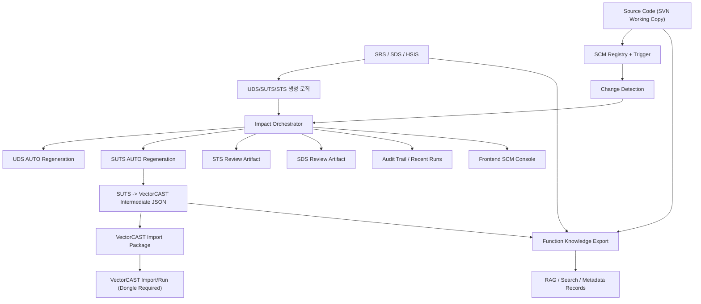
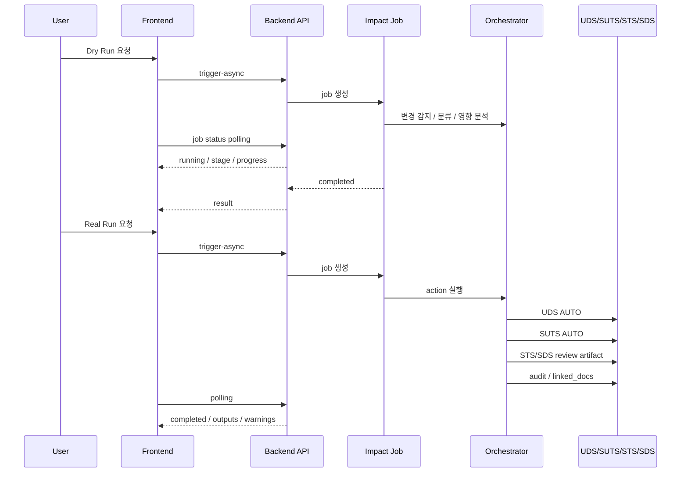

# SCM to VectorCAST Pipeline Overview

기준일: 2026-03-24  
프로젝트: `HDPDM01 / PDS64_RD`

## 1. 목적

이 문서는 현재 구현된 `SRS / SDS / HSIS / source -> UDS / STS / SUTS -> VectorCAST 준비물` 파이프라인의 전체 구조를 정리한다.

중점은 아래 4가지다.

1. 무엇이 구현되었는가
2. 실제로 어디까지 검증되었는가
3. 아직 실환경에서 테스트되지 않은 부분은 무엇인가
4. 운영자가 현재 시스템을 어떻게 이해해야 하는가

## 2. 전체 범위

현재 파이프라인은 아래 범위를 다룬다.

- 요구/설계 문서 입력
  - `SRS`
  - `SDS`
  - `HSIS`
- 소스코드 입력
  - SVN working copy 기반 변경 감지
- 영향 분석
  - changed files
  - changed functions
  - impacted functions
- 문서 처리
  - `UDS` 자동 재생성
  - `SUTS` 자동 재생성
  - `STS` review artifact
  - `SDS` review artifact
- 운영 UI
  - SCM 상태
  - dry-run / real-run
  - AUTO / FLAG 결과
  - recent runs / comparison / review workspace
- VectorCAST 준비
  - `SUTS -> intermediate JSON`
  - `intermediate -> import package`
  - `.tst/.env` 템플릿 생성
- RAG/검색용 통합 지식화
  - `design_doc`
  - `source_code`
  - `testcase`
  - `supplement`

## 3. 아키텍처 다이어그램

## 4. 실행 흐름

### 4-1. 기본 운영 흐름

### 4-2. 문서별 처리 정책

| 문서 | 처리 방식 | 현재 상태 |
|---|---|---|
| UDS | AUTO 재생성 | 구현됨 |
| SUTS | AUTO 재생성 | 구현됨 |
| STS | review artifact 생성 | 구현됨 |
| SDS | review artifact 생성 | 구현됨 |
| VectorCAST | import package 생성 | 준비 완료 |

## 5. 주요 구현 컴포넌트

### 5-1. SCM / Trigger

- `config/scm_registry.json`
- `backend/services/scm_registry.py`
- `backend/routers/scm.py`
- `workflow/change_trigger.py`
- `workflow/scm_fallback.py`
- `workflow/delta_update.py`

역할:
- SCM registry 관리
- SVN / git / hash fallback
- changed files / changed functions 계산
- dry-run / real-run 입력 정규화

### 5-2. 실행 / Job / Audit

- `workflow/impact_orchestrator.py`
- `workflow/impact_jobs.py`
- `workflow/impact_audit.py`
- `backend/routers/local.py`
- `backend/routers/jenkins.py`

역할:
- impact 분석
- AUTO / FLAG 전략 결정
- async job 상태 관리
- audit trail 저장
- linked_docs 갱신

### 5-3. 문서 생성

- `tools/generate_uds_local.py`
- `generators/suts.py`
- `generators/sts.py`
- `report_gen/*`

역할:
- UDS 생성
- SUTS 생성
- STS 관련 review 근거 생성

### 5-4. 프론트엔드

- `frontend/src/components/local/LocalScmPanel.jsx`
- `frontend/src/App.css`

역할:
- SCM 상태 표시
- registry 관리
- dry-run / real-run
- recent runs
- review preview
- run comparison
- operations 상태

### 5-5. VectorCAST 준비

- `tools/export_suts_vectorcast.py`
- `tools/export_vectorcast_script.py`
- `reports/vectorcast/*`

역할:
- SUTS -> VectorCAST intermediate JSON
- intermediate -> import package
- `.tst/.env` 템플릿 생성

### 5-6. RAG / Search 통합

- `tools/export_function_knowledge.py`
- `reports/rag/*`

역할:
- `design_doc`
- `source_code`
- `testcase`
- `supplement`
형식으로 통합 export

## 6. 현재 구현 완료 범위

### 6-1. 문서/코드 기반 생성

완료:
- SRS/SDS/HSIS/source 결합
- UDS 품질 개선
- STS/SUTS 생성/평가
- Traceability / Related / ASIL / Input / Output 안정화

### 6-2. SCM 영향 분석 파이프라인

완료:
- SCM registry
- SVN working copy 미커밋 변경 감지
- dry-run / real-run
- async job + polling
- audit trail
- recent runs
- linked_docs 갱신

### 6-3. Frontend 운영 흐름

완료:
- SCM registry 관리
- status / health
- dry-run / real-run 실행
- AUTO / FLAG 결과 카드
- review artifact preview
- recent runs
- run comparison
- operations panel
- failure UX

### 6-4. VectorCAST 준비

완료:
- SUTS -> intermediate JSON
- intermediate -> import package
- `cases.csv`
- `manifest.json`
- `import_instructions.md`
- `run_vectorcast_import.cmd`
- `vectorcast_tests.template.tst`
- `vectorcast_environment.template.env`

### 6-5. 통합 지식화

완료:
- UDS -> `design_doc`
- source -> `source_code`
- VectorCAST/SUTS -> `testcase`
- warnings -> `supplement`
- JSON / JSONL 출력

## 7. 실제 검증 완료 항목

### 7-1. 로컬/운영 검증

검증 완료:
- SVN working copy 인식
- dry-run 실행
- real-run 실행
- UDS AUTO 생성
- SUTS AUTO 생성
- STS review artifact 생성
- SDS review artifact 생성
- audit trail 생성
- frontend에서 결과 확인

### 7-2. 성능/운영 보강 검증

검증 완료:
- async job heartbeat
- target별 progress 표시
- stale lock 완화
- SUTS impact 최적화

참고:
- SUTS impact 실행은 전체 함수 기반에서 영향 함수 기반으로 최적화됨

### 7-3. VectorCAST 준비물 검증

검증 완료:
- intermediate JSON 생성
- import package 생성
- `.tst/.env` 템플릿 생성
- `TResultParser` 레퍼런스 반영

### 7-4. 통합 knowledge 검증

검증 완료:
- JSON / JSONL 생성
- kind별 분포 확인
- sample record 확인

## 8. 아직 실환경 검증이 안 된 부분

아래는 구현은 되어 있지만 실제 현장/도구 환경에서 끝까지 확인하지 못한 항목이다.

### 8-1. Jenkins 실서버 연동

상태:
- 엔드포인트와 코드 경로는 있음
- 단위/로컬 수준 검증은 했음
- 실제 Jenkins job에서 지속 운영 검증은 아직 미완

### 8-2. Webhook 실운영

상태:
- 설계/엔드포인트 축은 있음
- 실제 Git webhook 실운영 연동은 미검증

### 8-3. VectorCAST 실제 import / run

상태:
- 준비물 생성 완료
- 실제 import/run 검증은 동글/라이선스 필요

미검증 항목:
- 실제 environment 생성
- 실제 script import
- test case 반입
- run
- coverage/result 확인

### 8-4. Cold start 성능

상태:
- warm 상태는 개선됨
- cold cache 상태에서 UDS 쪽 첫 영향 분석은 여전히 시간이 걸릴 수 있음

즉:
- 기능 blocker는 아님
- 운영 최적화 영역

## 9. 현재 산출물 상태

### 9-1. VectorCAST 준비물

주요 파일:
- `reports/vectorcast/suts_vectorcast_20260324_105139.json`
- `reports/vectorcast/package_20260324_105139/manifest.json`
- `reports/vectorcast/package_20260324_105139/cases.csv`
- `reports/vectorcast/package_20260324_105139/vectorcast_tests.template.tst`
- `reports/vectorcast/package_20260324_105139/vectorcast_environment.template.env`

### 9-2. 통합 지식화 결과

주요 파일:
- `reports/rag/function_knowledge_20260324_120000.json`
- `reports/rag/function_knowledge_20260324_120000.jsonl`

현재 분포:
- `design_doc`: 368
- `source_code`: 368
- `testcase`: 66
- `supplement`: 52

총계:
- `854 records`

## 10. `TResultParser` 활용 결과

`TResultParser`는 단순 결과 파서가 아니라 아래 레퍼런스를 제공했다.

활용한 내용:
- 실제 VectorCAST `.tst` 문법 예시
- 실제 `.env` 템플릿 구조
- test name 관례
  - 예: `SwUFn_2104.001`
- 결과 파싱 모델
  - `TestCaseItem`
  - `VCastHeader`

이걸 통해 현재 package는 단순 CSV가 아니라, 실제 VectorCAST 형식을 닮은 템플릿까지 생성하게 보강되었다.

## 11. 현재 운영 판단

현재 상태를 운영 관점에서 요약하면 아래와 같다.

### 완료 수준

- `SRS/SDS/HSIS/source -> UDS/STS/SUTS`
- `SCM -> impact -> docs`
- `frontend 운영 흐름`
- `VectorCAST 준비물 생성`
- `RAG/search export`

### 마지막 남은 실제 환경 단계

- Jenkins 실운영 장기 검증
- VectorCAST 동글 환경에서 실제 import/run

즉, 시스템은 거의 닫혀 있고, 남은 것은 외부 운영 환경 검증 성격이다.

## 12. 권장 다음 순서

1. VectorCAST 동글 확보
2. `vectorcast_environment.template.env` 기반 실제 environment 생성
3. `vectorcast_tests.template.tst` 기반 import 시도
4. import 오류와 object path 차이 보정
5. run / result / coverage 검증
6. 필요 시 `export_vectorcast_script.py`를 실제 CLI 명령형으로 고정

## 13. 최종 결론

현재 파이프라인은 아래 수준까지 도달했다.

- 문서/코드 기반 생성 체계: 완료 수준
- SCM 기반 자동 갱신 파이프라인: 완료 수준
- frontend 운영 콘솔: 완료 수준
- VectorCAST 연결 직전 준비: 완료 수준
- 검색/RAG용 통합 지식화: 완료 수준

아직 끝나지 않은 것은 “설계/구현”이 아니라 “외부 툴 실환경 검증”이다.

한 줄 결론:

**이 시스템은 현재 `VectorCAST 실제 import/run 검증`만 남긴 상태로, 그 전 단계 파이프라인은 거의 완성됐다.**
