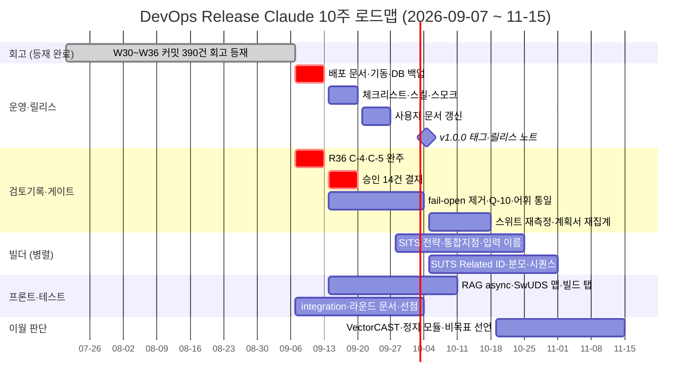

# DevOps Release Claude — 10주 로드맵 (2026-09-07 ~ 11-15)

작성일: 2026-09-07  
기준 커밋: `fbbdf7d8` (2026-09-07)  
Jira: `APPL` / 큰틀 `APPL-373` (ISO26262 설계단계 자료 기반 검사단계 산출물 자동화)  
선행 문서: `docs/plans/ARIA_자동화_고도화_실행계획_v2.md` (2026-08-04 이후 미갱신) — 본 문서가 그 §4 우선순위를 주 단위로 재배열한 후속판이다.  
근거: git 이력, 커밋 본문의 "남은 것 / 후속 / 보류" 표, `docs/rounds/sw_test_round_history.md`, `docs/plans/PLAN_2026-09-*`, 영역별 last-touch 실측.

## 1. 왜 다시 쓰는가

큰틀 `APPL-373`의 마지막 하위 작업은 **2026-07-20 종료**(APPL-381 운영 배포)이고, 그 뒤 7주 동안 실제로는 **커밋 390건**이 쌓였는데 Jira에는 아무것도 없다. `APPL-382`(사용자 피드백 및 개선)만 05-25~06-30 일정 그대로 "진행 중"에 멈춰 있고 부작업 7건도 같은 상태다.

선행 계획서(`ARIA_자동화_고도화_실행계획_v2.md`)도 08-04 이후 갱신이 없어, 그 안의 "미착수" 표기 일부는 이미 사실이 아니다(R27·R34에서 해소). 계획서 드리프트가 다음 라운드의 재발굴 비용으로 돌아온다.

그래서 두 가지를 같이 한다.

1. **회고**: 07-21 ~ 09-07의 커밋을 주차별 Task·부작업으로 등재하고 완료 처리한다(별도 문서 `2026-W30-W36_retro-plan_0721-0907.md`).
2. **전방**: 남아 있는 미완·이월·누락 항목을 8개 트랙으로 묶어 W37~W46에 배치한다(본 문서 §3).

## 2. 진행 현황 (2026-07-21 ~ 09-07)

| 주차 | 기간 | 실커밋 |
|---|---|---|
| W30 | 07-21 ~ 07-26 | 98 |
| W31 | 07-27 ~ 08-02 | 69 |
| W32 | 08-03 ~ 08-09 | 80 |
| W33 | 08-10 ~ 08-16 | 50 |
| W34 | 08-17 ~ 08-23 | 37 |
| W35 | 08-24 ~ 08-30 | 28 |
| W36 | 08-31 ~ 09-07 | 28 |

자동 스냅샷(`chore(auto)`)과 merge 커밋은 제외한 수치다. 같은 기간 테스트 스위트는 3,486 → 8,572로 늘었다.

## 3. 주 단위 계획 — 8개 병렬 트랙

주차: W37 09-07~13 · W38 09-14~20 · W39 09-21~27 · W40 09-28~10-04 · W41 10-05~11 · W42 10-12~18 · W43 10-19~25 · W44 10-26~11-01 · W45 11-02~08 · W46 11-09~15

| 트랙 (Jira) | W37 | W38 | W39 | W40 | W41 | W42 | W43~W46 |
|---|---|---|---|---|---|---|---|
| **[운영] APPL-711** | 배포 문서·스크립트·기동 명령 정정 / quality.sqlite 백업 | 릴리스 체크리스트·스킬·스모크 | README·SETUP·CHANGELOG | v1.0.0 태그·릴리스 노트 | — | — | — |
| **[검토기록] APPL-717** | R36 C-4 해시 배선 / C-5 매트릭스·리뷰 | 승인 14건 결재 | publish 권한·.bak 제거·4-eyes 판단 | — | — | — | — |
| **[게이트·품질] APPL-722** | — | fail-open 제거 | Q-10 실측 판정 | not_measured 어휘 통일 | 스위트 재측정·ratchet | 계획서 재집계 | — |
| **[SITS] APPL-728** | — | — | — | 전략·정리 시트 채우기 | 통합지점 규칙 재설계 | 입력 이름 축 공유 | 어휘 정규화 (W43) |
| **[SUTS] APPL-733** | — | — | — | — | Related ID 배선 | 커버리지 분모 | 시퀀스(W43)·INDIRECT(W44) |
| **[프론트·추적성] APPL-738** | — | RAG async 이관 | SwUDS 맵 주입 | 빌드 탭 게이트 반영 | 컬럼화·임계 결정 | — | — |
| **[테스트·문서] APPL-743** | 신규 라우터 integration | 라운드 문서 R26~R36 | 선점 헬퍼 | 인용 전 재측정 규약 | — | — | — |
| **[이월·판단] APPL-748** | — | — | — | — | — | — | VectorCAST(W43)·정지 모듈(W44)·트리거(W45)·비목표 선언(W46) |

각 셀은 Jira 부작업 1건이며 제목에 주차(`W3x`)를 달았다.

### W37에 몰아넣은 이유

배포 절차가 지금 그대로면 신규 PC에서 기동이 실패한다. 근거는 셋이다.

- `DEPLOY.md`(04-30)는 Docker Compose 기동을 표준으로 안내하는데 `CLAUDE.md`는 Docker/nginx 미사용을 명시한다. `config/admins.json`(실제 `admin_users.json`)·`localStorage devops_admin_mode`(현재 JWT)도 낡았다.
- `scripts/deploy.ps1`(03-30) 기본 포트가 8000인데 현재는 9000이다.
- `CLAUDE.md`가 안내하는 `cd backend && uvicorn main:app`으로 띄우면 `_META_CONFIG_PATH`가 CWD 상대경로라 meta config가 조용히 빈 값으로 로드된다.

검토 기록도 같은 주에 마감한다. BytesIO 빌더 4곳(`swut`·`swit`·`swsa`·`swreport`)에 `record_run(output_sha256=)`이 배선되지 않아 검토 대상이 **1,990 run 중 43건(2%)**에 그친다. 이 배선이 없으면 검토 기록 기능 자체가 사실상 동작하지 않는다.

검토 기록이 감사 증거가 된 이상 `reports/quality.sqlite`의 백업 절차가 있어야 하는데 backup·VACUUM 코드와 문서가 0건이다.

## 4. 간트 차트

## 5. 리스크와 관리

| 리스크 | 영향 | 관리 방안 |
|---|---|---|
| 배포 문서대로 하면 기동 실패 | 신규 환경 배포 불가 | W37 최우선 정정, W39 사용자 문서까지 연쇄 갱신 |
| 검토 기록이 run 2%에만 적용 | 감사 증거 공백 | W37 C-4 배선 후 커버율 재측정 |
| 승인 14건 미결재가 후속을 막음 | 여러 트랙 동시 지연 | W38 1회 결재 세션으로 일괄 처리 |
| `_finalize_trace_result` fail-open | SUTS 파싱 실패가 영구 은폐 | W38 0행을 warning/fail로 승격 |
| 스위트 월 1.9배 성장 | pre-commit 예산 초과로 게이트 조용히 강등 | W41 소요 재측정 + dist 모드 통일 |
| 계획서 드리프트(08-04 정지) | 해소된 항목이 "미착수"로 재발굴 | W42 ARIA v2 재집계, 본 문서를 정본으로 |
| 정지 모듈(SwSA 06-25·VectorCAST 파서 05-28~07-25·챗봇 06-24) | 릴리스 범위 불명 | W44 재가동/비목표 결정 |
| 외부 입력 대기 항목(SwIT PV spec·타 양식 v2.10/v3.10) | 임의 착수 시 재작업 | W45 재개 트리거만 문서화 |

## 6. 즉시 다음 액션 (W37)

1. `DEPLOY.md`·`scripts/deploy.ps1`·`CLAUDE.md` 기동 명령 정정 (APPL-711).
2. `reports/quality.sqlite` 백업·복원 절차 신설 (APPL-711).
3. BytesIO 빌더 4곳 `record_run(output_sha256=)` 배선 (APPL-717).
4. `/api/review`·`/api/quality`·docgen preflight integration 테스트 추가 (APPL-743).
5. 승인 14건 결재 일정 확정 — 사용자 결정이 필요한 유일한 블로커 (APPL-717).

## 7. 확인 메모

- 본 문서 작성 중 전체 테스트는 재실행하지 않았다. 수치는 커밋 본문·문서·`git log -- <path>` 기준이다.
- "재조사 금지"로 닫힌 축은 유지한다: S2bp 파라미터 중간마디, 배열 확장 신호, stub 정적 신호, `evaluate_uds`의 `global_min`/`static_min` 미배선.
- "ARIA"는 사이버보안 과제(APPL-418)와 본 저장소가 함께 쓰는 상위 명칭이다. 저장소 이름만 의도적으로 다르게 두었을 뿐 같은 프로젝트다.
