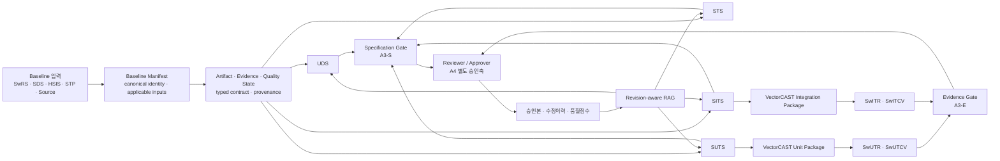
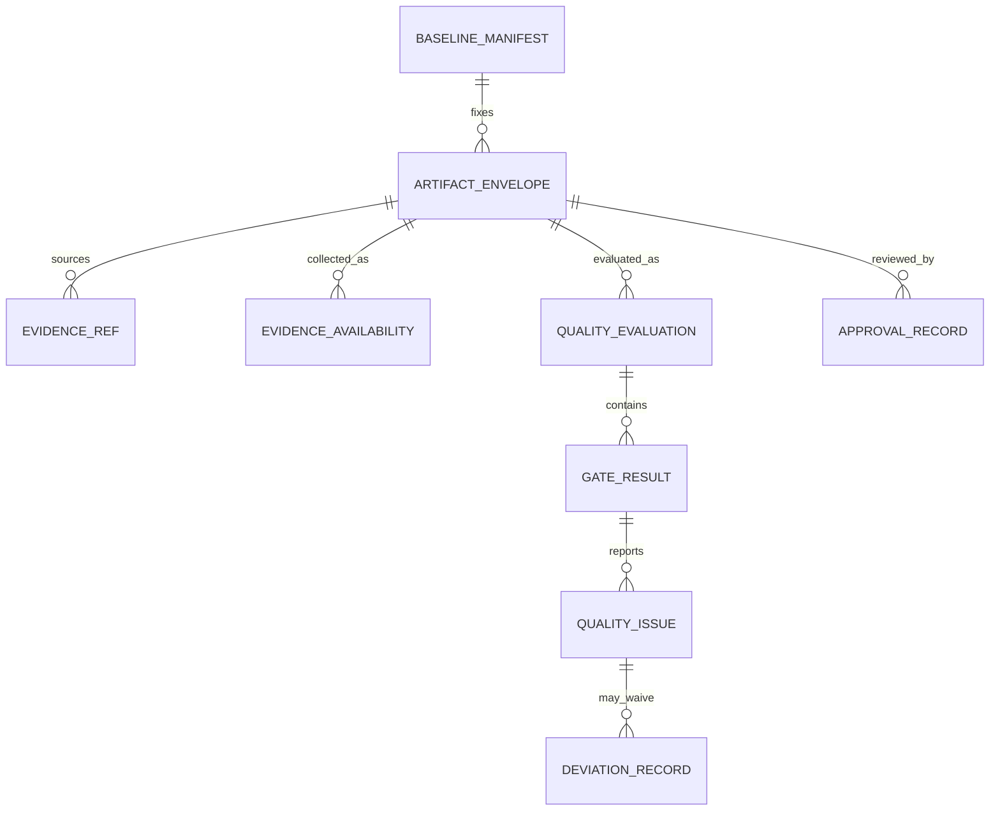

# ARIA ISO 26262 문서별 자동화 고도화 구현계획

> 기준일: 2026-07-28  
> 상태: 구현 착수용 초안 v1.2  
> 대상 저장소: `D:\Project\devops\Release_claude`  
> 용도: AI 코딩 에이전트 작업지시서, 개발·시험·기능안전 검토 기준, PPT 수정 근거  
> v1.1 보강: 공통 Artifact·Evidence·Quality State 스키마, Baseline Manifest·Fail-closed Gate, 명세·실행증거 성숙도 분리  
> v1.2 보강: Trace·Coverage 상태축 재분리, Evidence 가용성, Approval scope/revoke, 조직 KB 확장, LLM Context Gateway, CORE-000 PR 분해

---

## 1. 결론과 목표

현재 ARIA는 UDS, STS, SUTS, SITS와 VectorCAST 결과 보고서의 **초안 자동 생성에 필요한 핵심 엔진을 이미 보유**하고 있다. 남아 있는 문제는 새로운 생성기를 처음부터 만드는 문제가 아니라 다음 여섯 가지를 닫는 문제다.

1. 문서별 입력 경로와 baseline을 하나의 계약으로 고정한다.
2. 추정값·매핑값·실행값을 구분하고 모든 필드에 근거를 남긴다.
3. 현재 거짓 PASS 또는 과대 커버리지를 만들 수 있는 검증기를 fail-closed로 고친다.
4. SUTS/SITS와 VectorCAST 사이를 왕복 연결해 명세와 실행 결과를 같은 TC ID로 묶는다.
5. 승인된 산출물과 수정 이력을 revision-aware RAG에 축적해 다음 생성 품질을 높인다.
6. LLM context를 공통 gateway로 통제하고 조직 KB의 프로젝트·승인·보안 경계를 보장한다.

### 목표 상태

- **자동화 목표:** 문서 작성·갱신·검증은 `Specification Review-ready`, 실행결과 반영은 `Evidence-package Review-ready`까지 자동화한다.
- **사람이 유지할 책임:** 요구 적합성, ASIL 확정, 시험 oracle 확정, deviation 수용, 최종 Reviewer/Approver 서명.
- **연말 권고 KPI:** Pilot 문서군의 필수 필드 중 90% 이상이 수작업 재작성 없이 검토 가능한 상태. 개별 산출물 A3-S gate는 필수·안전중요 필드 100% disposition과 open BLOCK 0건을 별도로 요구한다.
- **금지 표현:** 자동 생성률 90%를 ISO 26262 준수율, 시험 통과율 또는 전체 V-model 완성도로 표현하지 않는다.

### Review-ready KPI 측정식

```text
Specification Review-ready rate
= 근거·스키마·추적성 gate를 통과하고 수작업 재작성 없이 승인 검토에 들어간 필수 필드 수
  / 해당 문서의 전체 필수 필드 수
```

90%·95% 목표는 문서군·Pilot 표본의 **자동 준비 성과 KPI**이며 개별 산출물을 A3-S로 승격시키는 합격선이 아니다. 개별 산출물은 필수·안전중요 필드 100% disposition, open BLOCK 0건, `A3S_SPEC` gate의 baseline 정합 및 field-evidence integrity 검사를 통과해야 한다. 예를 들어 전체 필드 기준 95%를 넘었더라도 안전중요 oracle 1건이 unresolved이면 해당 산출물은 A3-S가 아니다.

별도로 다음 지표를 유지한다.

| 지표 | 의미 | 합치면 안 되는 지표 |
|---|---|---|
| Link derivation distribution | direct / indirect / derived / inferred의 분포 | trace 해결률·시험 PASS |
| Trace resolution rate | resolved / proposed / unresolved / excluded_approved의 disposition 완료율 | link 생성 방식·시험 PASS |
| Test specification readiness | 실행 가능한 시험명세 준비율 | VectorCAST 실행률 |
| Execution verdict | PASS / FAIL / NOT_EXECUTED / UNKNOWN | 요구사항 커버리지 |
| Structural coverage | Statement / Branch / MC/DC / Function Call의 분자·분모 | TC 실행률 |
| ISO scope | SW 범위와 시스템 범위의 포함·제외 상태 | 위 지표들의 단순 합 |

---

## 2. 목표 아키텍처



### ARIA 내부 상태 코드

아래 코드는 구현·운영을 위한 **ARIA 내부 관리 상태**이며 ISO 26262 표준의 성숙도 등급이나 인증 등급이 아니다. 서로 다른 축의 행을 하나의 순차 사다리로 합치지 않는다.

| 상태축 | 코드 | 정의 | ARIA 목표 |
|---|---|---|---|
| 생성·명세 | A0 Extracted | 입력을 읽고 구조화함 | 현재 대부분 구현 |
| 생성·명세 | A1 Draft | 템플릿 초안 생성 | 현재 구현 |
| 생성·명세 | A2 Evidence-bound | 모든 중요 필드가 근거·authority·baseline을 가짐 | 2026 P0~P1 |
| 생성·명세 | A3-S Specification Review-ready | 필수·안전중요 필드 100% disposition, BLOCK 0건, trace·oracle 상태 명시 | 2026 P1 |
| 실행증거 | E0~E3 | package 생성, 실제 import, 결과 수집의 독립 단계 | 2026 P1~P2 |
| 실행증거 | A3-E Evidence-package Review-ready | VectorCAST TC·실행결과·coverage가 같은 적용 baseline에서 정합 | 2026 P2 |
| 사람 승인 | A4 Approved | 사람이 deviation·ASIL·oracle·서명을 승인 | 자동화 대상 아님 |

### 성숙도는 단일 상태값이 아니다

`gate_pass=true` 또는 하나의 `overall_score`로 문서 생성, 명세 품질, 실행증거, 시험결과와 승인을 함께 표현하지 않는다. 모든 산출물은 최소 다음 상태축을 독립적으로 가진다.

```text
QualityState
├─ generation_state              generated | partial | failed
├─ specification_maturity        not_applicable | A0 | A1 | A2 | A3_S
├─ execution_evidence_maturity   not_applicable | E0 | E1 | E2 | E3 | A3_E
├─ evidence_availability_state   not_applicable | not_available | partial | complete
├─ approval_state                not_reviewed | in_review | approved | rejected | stale | superseded
├─ overall_execution_verdict     not_available | PASS | FAIL | NOT_EXECUTED | UNKNOWN
├─ deviation_summary             open/approved/rejected/expired/stale count + record IDs
├─ coverage_measurement_state    not_applicable | not_measured | partial | measured
├─ coverage_target_state         not_evaluated | target_met | target_not_met
└─ release_gate_state            BLOCKED | REVIEW_REQUIRED | ELIGIBLE | ELIGIBLE_WITH_APPROVED_DEVIATION
```

실행증거의 중간 단계는 다음과 같이 사용한다.

| 실행증거 단계 | 의미 | 승격에 필요한 근거 |
|---|---|---|
| E0 No evidence | 실행 package 또는 결과 없음 | 없음 |
| E1 Package exported | VectorCAST 입력 package와 TC mapping 생성 | 내부 schema·manifest 검증 |
| E2 Import verified | 실제 라이선스 환경에서 package import 확인 | import receipt·tool/environment ID |
| E3 Results ingested | 실제 실행 결과와 coverage 원시값을 누락·truncation 없이 수집 | run ID·raw result/coverage hash·EvidenceAvailability complete |
| A3-E Reconciled | 명세 TC·툴 TC·result·coverage가 같은 baseline에서 disposition됨 | reconciliation BLOCK 0건 |

**상태 불변식**

1. `Specification Review-ready(A3-S)`는 VectorCAST PASS 여부와 무관하다. 명세 필수 필드, trace, oracle와 근거가 검토 가능한 상태를 뜻한다.
2. UDS·STS는 `execution_evidence_maturity=not_applicable`이어도 A3-S가 될 수 있다.
3. SUTS·SITS 명세 자체는 최대 A3-S로 평가한다. A3-E는 해당 명세와 연결된 **Unit/Integration Evidence Package**의 별도 상태다. 화면에는 `A3-E 연계 가능`으로 표시할 수 있으나 명세 상태를 A3-E로 덮어쓰지 않는다.
4. Unit/Integration Evidence Package의 A3-E는 연결된 SUTS/SITS가 A3-S이고 `test_spec_ref`가 정확히 일치할 때만 가능하다. A3-E 승격이 spec 상태를 변경하지는 않는다.
5. SwUTR·SwUTCV·SwITR·SwITCV는 `specification_maturity=not_applicable`이고, 실제 VectorCAST import·실행·reconciliation을 통과한 경우에만 조건부 A3-E가 될 수 있다.
6. `overall_execution_verdict=PASS`는 A3-S/A3-E를 자동 승격하지 않는다. 반대로 FAIL도 raw 결과와 trace가 완전하게 정합되면 A3-E 검토 준비 상태가 될 수 있지만 `release_gate_state=BLOCKED`다.
7. `UNKNOWN`, baseline 불일치 또는 validator 오류는 A3-E를 차단한다. 승인된 deviation도 raw FAIL/NOT_EXECUTED와 coverage 원시값을 바꾸지 않으며 해당 issue의 waiver와 `release_gate_state=ELIGIBLE_WITH_APPROVED_DEVIATION` 후보만 만든다.
8. A4와 문서 `approval_state=approved`는 Reviewer/Approver 권한을 가진 사람의 immutable `document_review` scope ApprovalRecord에서만 파생한다. 생성기·LLM·batch job은 release gate의 `ELIGIBLE*` 후보만 계산하며 “수용됨” 상태를 기록하지 못한다.
9. evidence 수집 가용성, TC별 raw verdict, coverage 측정 여부와 coverage 목표 달성 여부는 서로 다른 축이다. 결과 파일이 없거나 일부만 수집된 상태를 `NOT_EXECUTED`, `PASS`, `measured`로 대체하지 않는다.
10. 승인된 deviation이 있어도 `coverage_target_state=target_not_met`와 원시 분자·분모는 유지한다. 승인은 해당 QualityIssue의 waiver와 release 후보에만 반영한다.

### 문서 종류별 상태 적용

| 산출물 | 명세 성숙도 | 실행증거 성숙도 | 실행 verdict | 사람 승인 |
|---|---|---|---|---|
| UDS | A0~A3-S | N/A | N/A | 설계 의도·ASIL·trace 승인 |
| STS | A0~A3-S | N/A | N/A | 시험방법·oracle·ASIL 적정성 승인 |
| SUTS | A0~A3-S | 별도 Unit Evidence Package로 E0~A3-E | package 결과에서 관리 | oracle·stub·coverage 목표 승인 |
| SITS | A0~A3-S | 별도 Integration Evidence Package로 E0~A3-E | package 결과에서 관리 | component·timing·동적 호출 승인 |
| SwUTR·SwITR | N/A | E0~A3-E | PASS/FAIL/NOT_EXECUTED/UNKNOWN | 결과·deviation 승인 |
| SwUTCV·SwITCV | N/A | E0~A3-E | 측정 상태·목표 달성 상태 분리 | 목표·exception·deviation 승인 |

---

## 3. 공통 기반 작업

문서별 기능을 고치기 전에 아래 계약을 먼저 구현한다. 공통 계약 없이 각 생성기를 별도로 수정하면 같은 오류가 다른 문서에서 반복된다.

### CORE-000 — 공통 Artifact·Evidence·Quality State 스키마

**목적**

UDS, STS, SUTS, SITS, VectorCAST package와 결과 보고서가 서로 다른 임의 dict와 단일 `gate_pass`를 사용하지 않도록 공통 envelope와 상태 언어를 만든다. 현재 `workflow/quality/models.py`의 `GenerationRun.status`, `QualitySummary.overall_score`, `QualitySummary.gate_pass`는 이 구분을 표현하기에 부족하므로 표시용 legacy 값으로만 유지하고 단계적으로 typed state로 전환한다.

#### 1) ArtifactEnvelope

모든 입력·중간산출물·출력은 payload 밖에 다음 공통 envelope를 가진다.

| 필드 | 형식 | 필수 | 의미 |
|---|---|---:|---|
| `schema_version` | string | Y | 공통 계약 버전. 최초 `1.0` |
| `artifact_id` | string | Y | 산출물 revision 단위 immutable ID |
| `artifact_type` | enum | Y | `swrs`, `sds`, `hsis`, `uds`, `sts`, `suts`, `sits`, `vcast_package`, `swutr`, `swutcv`, `switr`, `switcv`, `baseline_manifest` |
| `artifact_role` | enum | Y | `input`, `specification`, `execution_package`, `result`, `coverage`, `manifest` |
| `artifact_origin_class` | enum | Y | `authoritative_input`, `derived_draft`, `tool_raw`, `tool_report` |
| `project_id` | string | Y | 경로가 아닌 안정적인 프로젝트 ID |
| `baseline_manifest_id` | string/null | C | 파생 산출물은 필수. raw input과 manifest 자체는 null |
| `document_id` | string | Y | 문서 계보를 식별하는 안정 ID |
| `document_revision` | string | Y | 문서 자체 revision |
| `content_sha256` | string | Y | artifact type별 canonical logical payload hash |
| `binary_sha256` | string/null | Y | 실제 파일 byte hash. 파일이 없으면 null |
| `generator_name` | string | Y | 생성기 또는 importer 이름 |
| `generator_version` | string | Y | 코드 version/commit |
| `created_at` | UTC datetime | Y | 생성 시각. baseline hash 계산에서는 제외 |
| `parent_artifact_ids` | list[string] | Y | 직접 입력·이전 단계 산출물 ID |
| `supersedes_artifact_id` | string/null | Y | 대체하는 이전 revision. 없으면 null |
| `lifecycle_state` | enum | Y | version 생명주기 `active`, `superseded`, `withdrawn` |

**Artifact 불변식**

- 같은 `artifact_id`의 `content_sha256`는 바뀌지 않는다. 내용이 바뀌면 새 artifact ID와 revision을 만든다.
- raw input과 BaselineManifest의 envelope는 `baseline_manifest_id=null`이다. Manifest가 자기 ID를 참조하거나 자신의 hash 계산에 자기 ID를 넣어 순환 참조를 만들지 않는다.
- 승인 여부는 ArtifactEnvelope에 저장하지 않는다. immutable `ApprovalRecord`가 SSOT이고 QualityState의 approval state는 파생 view다. ArtifactEnvelope의 lifecycle은 version의 활성·대체 상태만 나타낸다.
- 생성기 출력의 기본값은 문서 종류와 무관하게 `artifact_origin_class=derived_draft`다. A3-E 보고서도 자동으로 승인본이 되지 않는다.
- `superseded` artifact는 현재 baseline 검색의 기본 후보와 성숙도 분모에서 제외하되 audit trail에서는 삭제하지 않는다.
- 파일 경로는 위치 정보일 뿐 identity가 아니다. identity는 project/document/revision/hash로 판단한다.

**Artifact hash 규칙**

- JSON·sidecar는 key 정렬과 명시적 null 정책을 적용한 canonical JSON을 hash한다.
- DOCX/XLSX/XLSM/PPTX는 ZIP metadata·생성시각이 달라도 논리 내용이 같으면 같은 `content_sha256`가 되도록 정규화된 paragraph/cell/object/ID sidecar를 hash한다.
- Office 원본 byte는 별도 `binary_sha256`로 보존한다. binary hash가 다르더라도 logical payload hash가 같으면 내용 동등으로 볼 수 있지만 macro·embedded object 정책은 artifact type profile에서 별도 검사한다.
- source/text는 encoding·line ending 정규화 규칙을 schema version으로 고정하며 raw byte hash도 함께 보존한다.

#### 2) EvidenceRef

필드와 trace link가 어떤 자료에서 왔는지 다음 구조로 저장한다.

| 필드 | 형식 | 필수 | 의미 |
|---|---|---:|---|
| `evidence_id` | string | Y | evidence record ID |
| `source_artifact_id` | string | Y | 출처 ArtifactEnvelope ID |
| `source_type` | enum | Y | 실제 원본 종류: `swrs`, `sds`, `uds`, `hsis`, `source`, `vectorcast`, `human_review` |
| `source_path` | string | Y | 표시·재조회용 논리 경로 |
| `locator_type` | enum | Y | `requirement_id`, `function_line`, `sheet_cell`, `paragraph`, `testcase_id`, `coverage_item` |
| `locator` | string | Y | 실제 위치 값 |
| `source_sha256` | string | Y | 출처 내용 hash |
| `baseline_manifest_id` | string | Y | 출처가 속한 baseline |
| `capture_method` | enum | Y | `deterministic_parser`, `tool_import`, `rag_retrieval`, `llm_proposal`, `human_entry` |
| `authority_class` | enum | Y | `authoritative_input`, `derived_evidence`, `tool_raw`, `human_review` |
| `derivation` | enum | Y | `direct`, `indirect`, `derived`, `inferred`, `generated` |
| `confidence` | number/null | Y | 0~1. 결정론·실측은 정책상 1.0, 미사용 시 null |
| `verification_state` | enum | Y | `unverified`, `verified`, `rejected`, `not_measurable` |
| `extractor_version` | string | Y | parser/importer/retriever version |
| `review_record_id` | string/null | Y | 사람의 확정·반려 기록. 없으면 null |

**Evidence 불변식**

- confidence가 높다는 이유만으로 `verification_state=verified` 또는 `FieldState.review_state=confirmed`로 승격하지 않는다.
- confidence는 “추출·연결 방식의 확실성”을 나타내는 보조정보이며 내용의 의미적 정확성이나 권위성을 뜻하지 않는다. 권위성은 `authority_class`와 ApprovalRecord로 판단한다.
- `llm_proposal`과 `rag_retrieval`은 기본 `unverified`다. RAG는 원본 종류가 아니라 retrieval channel이며, citation은 반드시 실제 권위 원본의 artifact ID·hash·approval state를 가리킨다.
- 출처 artifact hash가 바뀌면 stale이다. source manifest와 current manifest ID가 다르다는 이유만으로 stale 처리하지 않고 CORE-001의 관계별 compatibility profile로 비교한다. 예를 들어 spec manifest와 execution manifest는 execution context 때문에 ID가 달라도 `SPEC_TO_EXECUTION` 필수 key가 일치하면 compatible하다.
- `excluded`는 Evidence derivation이 아니라 trace resolution이다. owner·사유·승인·expiry revision이 있는 `ExclusionRecord`로 별도 관리한다.

#### 3) EvidenceAvailability

입력 또는 실행증거를 “얼마나 수집했는가”는 문서 생성 성공 및 raw verdict와 분리한다.

| 필드 | 형식 | 의미 |
|---|---|---|
| `availability_id` | string | 수집 시도 단위 immutable ID |
| `source_kind` | enum | `requirement`, `design`, `source`, `test_spec`, `vectorcast_result`, `coverage` |
| `availability_state` | enum | `not_applicable`, `not_available`, `partial`, `complete` |
| `expected_source_count` | int/null | 정책·manifest가 기대하는 입력 수. 알 수 없으면 null |
| `collected_source_count` | int | 정상 수집한 입력 수 |
| `missing_source_ids` | list[string] | 기대했으나 없는 입력 ID |
| `parse_error_source_ids` | list[string] | 존재하지만 파싱하지 못한 입력 ID |
| `truncated` | boolean | page/row/result cap 때문에 일부만 반환됐는지 여부 |
| `returned_count`, `total_count` | int/null | pagination 또는 원격 조회의 반환·전체 건수 |
| `source_content_hashes` | list[string] | 실제 수집한 source hash |

**가용성 불변식**

- 결과 파일 자체가 없으면 `not_available`이며 overall verdict도 `not_available`이다.
- VectorCAST가 TC를 인식했지만 명시적으로 미실행 verdict를 낸 경우에는 수집 가용성이 `complete`일 수 있고 raw verdict는 `NOT_EXECUTED`다. 파일 부재를 `NOT_EXECUTED`로 합성하지 않는다.
- 기대 source 일부 누락, 일부 파싱 실패, `truncated=true` 또는 `returned_count < total_count`이면 `partial`이다. 수집된 TC의 raw verdict는 보존하되 package aggregate는 `UNKNOWN`이며 E3/A3-E 승격을 차단한다.
- `complete`는 적용 가능한 기대 source가 정합되고, missing/parse error가 0건이며, truncated가 false일 때만 가능하다.
- `generation_state`는 출력 생성 상태이고 `availability_state`는 입력·증거 수집 상태다. 어느 한쪽을 다른 쪽에서 자동 추론하지 않는다.

#### 4) FieldState

출처 방식, trace 판정과 사람 검토 상태를 한 enum에 섞지 않는다.

| 필드 | 형식 | 의미 |
|---|---|---|
| `object_id`, `field_name` | string | 대상 객체와 필드 |
| `value` | any | 현재 값 |
| `required`, `safety_critical` | boolean | template/profile상 필수·안전중요 여부 |
| `origin_kind` | enum | `parsed`, `derived`, `generated`, `rag_proposed`, `human_entered` |
| `trace_resolution_state` | enum | `not_applicable`, `resolved`, `proposed`, `unresolved`, `exclusion_candidate`, `excluded_approved` |
| `trace_link_ids` | list[string] | 이 필드의 해결 근거가 되는 TraceLink ID |
| `review_state` | enum | `proposed`, `confirmed`, `rejected`, `unresolved` |
| `evidence_ids` | list[string] | 연결 EvidenceRef |
| `exception_refs` | list[object] | `{kind: exclusion|deviation, id}`. 원시값을 변경하지 않음 |

필수·안전중요 필드는 최소 하나의 유효 evidence 또는 승인된 exclusion/deviation을 가져야 한다. `origin_kind`, `trace_resolution_state`, `review_state` 중 하나를 다른 값에서 자동 추론하지 않는다. `direct/indirect/derived/inferred`는 FieldState가 아니라 연결된 TraceLink의 생성 방식이다.

#### 5) ApprovalRecord·DeviationRecord

`ApprovalRecord`는 append-only 승인 SSOT다.

| 객체 | 핵심 필드 |
|---|---|
| `ApprovalRecord` | `approval_id`, `approval_scope`, `subject_type`, `subject_id`, `artifact_id`, `content_sha256`, `baseline_manifest_id`, `policy_id/version`, `actor_id`, `actor_role`, `decision`, `supersedes_approval_id`, `revokes_approval_id`, `comment`, `created_at`, `signature_ref` |
| `DeviationRecord` | `deviation_id`, `issue_ids`, `artifact_id`, `content_sha256`, `baseline_manifest_id`, `policy_id/version`, `rationale`, `safety_impact`, `owner`, `status`, `approval_id`, `approved_at`, `expiry_revision` |

- `ApprovalRecord.decision`은 `approved`, `rejected`, `revoked`이고 인증된 human actor만 생성할 수 있다.
- `approval_scope`는 `field_review`, `document_review`, `deviation_approval`, `exclusion_approval`, `release_approval` 중 하나다. 서로 다른 scope의 승인은 상호 대체하지 않는다.
- `field_review` 승인은 해당 FieldState의 검토만 확정하며 문서 A4가 아니다. `document_review` 승인만 같은 artifact의 A4 후보가 되고, `release_approval`만 release 승인 후보가 된다.
- `deviation_approval`과 `exclusion_approval`은 지정 issue·target만 승인하며 문서 A4 또는 release 승인으로 승격되지 않는다. DeviationRecord와 ExclusionRecord의 `approval_id`도 각각 일치하는 scope를 참조해야 한다.
- `decision=revoked`이면 `revokes_approval_id`가 필수이며 같은 scope·subject의 현재 유효한 과거 `approved` record를 가리켜야 한다. revoked record에는 `supersedes_approval_id`를 동시에 두지 않는다.
- `supersedes_approval_id`는 같은 scope·subject의 과거 record만 가리키며 current view에서 이전 record를 superseded로 만든다. supersede/revoke 연결은 append-only이고 순환 참조를 허용하지 않는다.
- Deviation은 issue 범위가 명시된 record다. 한 deviation의 승인이 다른 BLOCK issue를 waive하지 않는다.
- artifact content, baseline 또는 policy가 바뀌면 연결 ApprovalRecord·DeviationRecord는 current view에서 `stale`이 된다.
- open·rejected·expired·stale deviation이 하나라도 BLOCK issue에 연결돼 있으면 release gate는 BLOCKED다.
- `FieldState.review_state=confirmed`, ExclusionRecord 승인과 QualityState approval state도 연결 ApprovalRecord 없이는 설정할 수 없다.

#### 6) QualityState

```python
class QualityState:
    evaluation_id: str
    artifact_id: str
    artifact_content_sha256: str
    baseline_manifest_id: str
    policy_id: str
    policy_version: str
    input_fingerprint: str
    generation_state: str               # generated | partial | failed
    specification_maturity: str         # not_applicable | A0 | A1 | A2 | A3_S
    execution_evidence_maturity: str    # not_applicable | E0 | E1 | E2 | E3 | A3_E
    evidence_availability_state: str    # not_applicable | not_available | partial | complete
    evidence_availability_ids: list[str]
    approval_state: str                 # ApprovalRecord에서 파생
    overall_execution_verdict: str      # not_available | PASS | FAIL | NOT_EXECUTED | UNKNOWN
    verdict_counts: dict[str, int]       # TC별 raw verdict count
    deviation_record_ids: list[str]
    deviation_counts: dict[str, int]     # open/approved/rejected/expired/stale
    coverage_measurement_state: str     # not_applicable | not_measured | partial | measured
    coverage_target_state: str          # not_evaluated | target_met | target_not_met
    release_gate_state: str             # BLOCKED | REVIEW_REQUIRED | ELIGIBLE | ELIGIBLE_WITH_APPROVED_DEVIATION
    blocker_codes: list[str]
    warning_codes: list[str]
    gate_results: list["GateResult"]
    evaluator_version: str
    assessed_at: str
```

`overall_score`는 dashboard 추세용 보조지표로만 사용한다. 다음 상태는 score 평균으로 계산하지 않고 명시적 gate 규칙으로만 승격한다.

```text
specification_maturity
execution_evidence_maturity
evidence_availability_state
approval_state
overall_execution_verdict
deviation_counts
coverage_measurement_state
coverage_target_state
release_gate_state
```

`QualityIssue`는 최소 `issue_id`, `rule_code`, `rule_version`, `severity(BLOCK/WARN/INFO)`, `issue_state(OPEN/RESOLVED/WAIVED)`, `object_id`, `field_name`, `evidence_ids`, `exception_refs`, `owner`, `message`를 가진다. 승인된 deviation은 지정 issue만 `WAIVED`로 바꾸며 raw execution verdict와 coverage 분자·분모를 변경하지 않는다.

**package aggregate verdict 기본 정책**

1. 기대 TC 또는 tool evidence 자체가 없으면 `evidence_availability_state=not_available`, verdict는 `not_available`.
2. evidence 가용성이 `partial`이면 수집된 TC별 raw verdict는 보존하되 package aggregate는 `UNKNOWN`.
3. 가용성이 `complete`이고 TC별 raw verdict에 UNKNOWN이 하나라도 있으면 `UNKNOWN`.
4. 그 외 FAIL이 하나라도 있으면 `FAIL`.
5. 그 외 NOT_EXECUTED가 하나라도 있으면 `NOT_EXECUTED`.
6. 하나 이상의 TC가 있고 전부 PASS일 때만 `PASS`.

**coverage 상태 기본 정책**

1. versioned policy가 `applicable=false`로 명시한 metric만 `coverage_measurement_state=not_applicable`, `coverage_target_state=not_evaluated`, percentage `null`이다.
2. `applicable=true`인데 분모가 누락됐거나 0이면 `not_measured + not_evaluated`이며 `COVERAGE_NOT_MEASURED` BLOCK이다. 자동 N/A·0%·100%·PASS를 금지한다.
3. 일부 결과만 수집되거나 truncated이면 `partial + not_evaluated`이고 reconciliation을 차단한다.
4. 완전 측정됐으나 threshold 미달이면 `measured + target_not_met`이다. 승인 deviation이 있어도 이 사실은 유지한다.
5. 완전 측정되고 threshold 이상일 때만 `measured + target_met`이다.

`deviation_pending`·`deviation_approved`는 coverage target 상태값으로 넣지 않는다. 목표 달성 사실과 예외 수용 여부가 다시 섞이지 않도록 DeviationRecord와 release gate에서 독립 관리한다.

deviation 승인은 TC별 raw verdict와 위 aggregate raw verdict를 변경하지 않는다. 프로젝트가 다른 우선순위를 쓰려면 versioned policy로 명시하고 기존 결과를 재평가한다.

#### 7) 공통 관계



`QualityEvaluation`은 QualityState snapshot을 append-only로 저장한다. 같은 artifact를 policy v1/v2로 재평가해도 기존 row를 덮어쓰지 않으며 `current_quality_evaluation_id` 포인터 또는 materialized view만 최신 평가를 가리킨다.

#### 권고 파일

- 신규: `workflow/contracts/artifact.py`
- 신규: `workflow/contracts/evidence.py`
- 신규: `workflow/contracts/evidence_availability.py`
- 신규: `workflow/contracts/quality_state.py`
- 신규: `workflow/contracts/approval.py`
- 신규: `workflow/contracts/deviation.py`
- 신규: `workflow/contracts/enums.py`
- 신규: `workflow/contracts/serialization.py`
- 수정: `workflow/quality/models.py`, `workflow/quality/recorder.py`, `workflow/quality/evaluator.py`
- 수정: 각 generator/importer의 API summary adapter

#### 구현 분해 — CORE-000A~F

CORE-000 전체를 한 PR로 구현하지 않는다. 공통 계약의 선후관계를 유지하면서 다음 여섯 작업으로 나누며 각 subtask ID를 기본 1개 PR로 한다.

| Task ID | 범위 | 선행 작업 | PR 종료 조건 |
|---|---|---|---|
| CORE-000A | enum·typed contract와 상태축 정의 | 없음 | Trace·Coverage·Evidence·Approval 축의 schema test 통과 |
| CORE-000B | ArtifactEnvelope·EvidenceRef·EvidenceAvailability serialization과 canonical hash | CORE-000A | JSON/Office hash와 partial 수집 fixture 통과 |
| CORE-000C | ApprovalRecord·DeviationRecord·ExclusionRecord append-only event model | CORE-000A~B | scope·supersede·revoke 불변식 통과 |
| CORE-000D | QualityEvaluation DB migration과 current view | CORE-000A, C | 기존 row 보수적 migration·history 보존 |
| CORE-000E | API compatibility adapter와 legacy field deprecation | CORE-000D | DB·API·sidecar 동일 state 반환 |
| CORE-000F | 각 generator/importer·worker의 공통 계약 채택 | CORE-000B, E | 임의 dict·단일 `gate_pass` 우회 0건 |

CORE-001과 CORE-002는 CORE-000A~B 이후 병렬 착수할 수 있다. CORE-003·CORE-005는 CORE-000C~E를 사용하고, 문서별 생성기 전환은 CORE-000F에서 단계적으로 수행한다.

#### DB·API migration

1. `GenerationRun`에 `artifact_id`, `baseline_manifest_id`, `schema_version`, `generator_version`을 추가한다.
2. append-only `QualityEvaluation`, `EvidenceAvailability`, `ApprovalRecord`, `DeviationRecord` table을 추가하고 `QualitySummary`는 current materialized view로 전환한다.
3. 기존 `overall_score`, `gate_pass`는 한 release 동안 read-only compatibility field로 유지하고 `deprecated=true`를 API schema에 표시한다.
4. 기존 row는 `baseline_unknown`, `specification_maturity=A1`, `execution_evidence_maturity=E0`, `approval_state=not_reviewed`, `release_gate_state=BLOCKED`로 migration한다. legacy row를 A3-S/A3-E로 자동 backfill하지 않는다.
5. API는 `generation_succeeded`, `specification_review_ready`, `evidence_package_review_ready`, `release_eligible`을 별도 boolean으로 반환하되 source of truth는 typed state와 GateResult다.

#### 테스트

- `overall_score=100`이어도 evidence가 없으면 A3-E가 되지 않음.
- VectorCAST PASS여도 baseline mismatch가 있으면 A3-E와 release gate 모두 BLOCK.
- VectorCAST FAIL이지만 import·raw result·TC reconciliation이 완전하면 A3-E는 가능하고 release gate는 BLOCK.
- UDS/STS의 실행증거 상태가 N/A여도 근거와 trace gate를 통과하면 A3-S 가능.
- LLM confidence 1.0이어도 review/evidence 없이 confirmed 또는 approved로 승격되지 않음.
- 승인 권한이 없는 worker가 ApprovalRecord 또는 파생 `approval_state=approved`를 쓰면 거부.
- field review가 문서 A4를 만들지 않고 deviation 승인이 release 승인으로 승격되지 않음.
- revoke는 같은 scope·subject의 과거 approved record를 명시적으로 참조하며 승인 chain 순환은 거부.
- 결과 파일 없음과 명시적 `NOT_EXECUTED`가 구분되고 partial·truncated 수집은 A3-E를 차단.
- coverage 측정 여부와 목표달성 여부가 독립적으로 저장되며 승인 deviation 후에도 `target_not_met` 보존.
- legacy row가 A3-S/A3-E로 자동 승격되지 않음.
- 동일 artifact를 다른 policy version으로 재평가해도 이전 QualityEvaluation과 ApprovalRecord 이력이 보존됨.
- logical Office 내용은 같고 ZIP metadata만 다를 때 `content_sha256`는 같고 `binary_sha256`만 다를 수 있음.

#### 완료 조건

- 신규 산출물의 공통 envelope 누락 0건.
- API, 품질 DB, 파일 sidecar JSON의 QualityState 값 불일치 0건.
- 단일 `gate_pass`가 A3-S, A3-E 또는 release 적합성을 대신하는 호출 0건.

---

### CORE-001 — Baseline 및 산출물 컨텍스트 SSOT

**목적**

모든 생성 문서와 결과 보고서가 동일한 프로젝트·소스·요구사항·템플릿·VectorCAST 실행 기준인지 기계적으로 비교한다.

**구현**

단순 필드 묶음 `ArtifactBaseline`이 아니라 content-addressed `BaselineManifest`를 SSOT로 추가한다. 문서 종류별 policy에서 `applicable=true`인 입력만 필수로 평가하므로 UDS·STS에 가짜 `vectorcast_environment`를 채우지 않는다.

#### BaselineManifest

| 필드 | 계약 |
|---|---|
| `manifest_schema_version` | canonicalization 규칙 버전 |
| `manifest_id` | canonical identity JSON의 SHA-256 |
| `project_id` | 프로젝트 고유 ID |
| `manifest_state` | `complete`, `incomplete`, `unknown` |
| `scope` | `iso_scope`, included/excluded bands, scope owner |
| `scm` | SCM 종류·repository ID·immutable revision·source tree/build hash |
| `inputs[]` | `role`, `logical_id`, `revision`, `content_sha256`, `approval_record_id`, `required`, `applicable` |
| `template` | template ID·version·SHA-256. 물리 path는 참고정보 |
| `generator` | name·version·build/config SHA-256 |
| `test_spec_ref` | 실행증거에서 사용한 SUTS/SITS artifact ID와 content SHA-256 |
| `execution_context` | 적용 시 VectorCAST version·environment ID·project config hash·compiler/options hash·harness/stub hash·coverage config hash·instrumentation config hash·run ID |
| `rag_snapshot` | 적용 시 index version·snapshot ID·hard-filter hash |
| `created_at` | 감사용 시각. manifest identity 비교에서는 제외 |

`inputs[]`의 role은 최소 `swrs`, `sds`, `uds`, `hsis`, `stp`, `source`를 지원한다. 해당 문서 policy에서 사용하지 않는 role은 `applicable=false`로 명시하고 dummy ID·빈 hash를 만들지 않는다.
각 항목은 Manifest bootstrap용 `InputFingerprint`이며 파생 ArtifactEnvelope의 `baseline_manifest_id`를 요구하지 않는다.

#### Manifest identity 규칙

```text
manifest_id
= SHA-256(
    UTF-8 canonical JSON(
      project_id + scope + scm + applicable inputs
      + template identity + generator identity
      + applicable test_spec_ref/execution_context/rag_snapshot
    )
  )
```

- canonical JSON은 key 정렬, path separator·revision 표기 정규화와 명시적 null 정책을 사용한다.
- `manifest_id`, `created_at`, 물리 `template_path`, output path와 임시 materialization path는 identity 계산에서 제외한다.
- manifest를 읽을 때 저장된 `manifest_id`를 재계산한다. 다르면 `MANIFEST_TAMPERED` BLOCK이다.
- `unknown`은 값이 아니다. 두 개의 `baseline_unknown`을 서로 MATCH로 판정하지 않는다.
- UDS/STS/SUTS/SITS 품질 JSON, VectorCAST export JSON, SwUT/SwIT summary와 AuditLog는 manifest 전체를 복제하지 않고 `baseline_manifest_id`와 필요한 표시용 summary를 기록한다.

#### 관계별 비교 profile

| 비교 profile | 필수 비교 | 적용 gate |
|---|---|---|
| `SPEC_INPUT` | project, applicable 요구·설계·source revision/hash, template, generator policy | A2·A3-S |
| `SPEC_TO_EXECUTION` | project, source build, 정확한 SUTS/SITS artifact ID·content hash, VectorCAST environment/toolchain/harness/coverage config | E2~A3-E |
| `REPORT_REGEN` | execution run ID, raw result hash, raw coverage hash, report template/generator | 결과 보고서 재생성 |
| `RAG_RETRIEVAL` | project, current revision, approval state, valid/superseded range, filter hash | RAG citation |

비교 결과는 필드별 `MATCH`, `MISMATCH`, `UNKNOWN`, `NOT_APPLICABLE`로 반환한다. policy상 필수인 항목의 MISMATCH·UNKNOWN은 해당 gate를 BLOCK한다. 실행 baseline mismatch는 기존 specification maturity를 변경하지 않고 execution evidence gate만 차단한다.

**권고 파일**

- 신규: `workflow/contracts/baseline_manifest.py`
- 신규: `workflow/contracts/baseline_policy.py`
- 수정: `workflow/common.py`
- 수정: `generators/sts.py`, `generators/suts.py`, `generators/sits.py`
- 수정: `report_gen/uds_generator.py`
- 수정: `backend/services/swut_input_adapter.py`
- 수정: `backend/services/swit_input_adapter.py`
- 수정: `workflow/quality/models.py`, `workflow/quality/recorder.py`

**테스트**

- 동일 revision끼리 통합 성공.
- 물리 path·`created_at`만 다르고 logical identity와 hash가 같으면 MATCH.
- source hash, requirement/design baseline, SUTS/SITS content hash 또는 execution context가 다르면 대상 gate BLOCK.
- 두 `baseline_unknown`은 MATCH가 아님.
- manifest identity field 변조 후 hash 재검증 시 `MANIFEST_TAMPERED`.
- legacy 입력은 `baseline_unknown`으로 읽되 Specification/Evidence-package Review-ready 승격은 금지.

**완료 조건**

- 모든 신규 산출물에 baseline 필드 누락 0건.
- 서로 다른 baseline의 명세와 결과가 자동으로 합쳐지는 사례 0건.

---

### CORE-002 — 로컬·워커 공통 FileResolver

**목적**

U: 드라이브처럼 워커로만 읽을 수 있는 입력이 `Path.is_file()` 때문에 누락되는 문제를 제거한다.

**구현**

- 생성기에서 직접 `Path.read_*`, `Path.is_file()`을 호출하지 않고 `FileResolver` 계약을 사용한다.
- resolver가 제공해야 할 기능:
  - `exists`
  - `read_bytes`
  - `read_text`
  - `stat`
  - `sha256`
  - 필요한 경우 임시 로컬 materialization
- Cloudium worker는 기존 정책대로 read-only를 유지한다.
- 임시 materialization은 작업 종료 시 정리하고 원격 원본에는 쓰지 않는다.

**권고 파일**

- 수정: `backend/services/file_resolver.py`
- 수정: `generators/sts.py`, `generators/suts.py`, `generators/sits.py`
- 수정: `workflow/rag/ingestor.py`
- 수정: UDS 입력을 조립하는 `backend/helpers/uds.py`

**테스트**

- local resolver와 worker resolver가 동일 fixture에서 동일 hash와 파싱 결과를 반환.
- worker-only SRS/SDS/UDS/HSIS가 생성 단계에서 건너뛰어지지 않음.
- worker 경로 write 시도는 거부.

**완료 조건**

- 생성기 내부의 입력 존재 확인이 resolver를 우회하는 코드 0건.
- worker-only 실데이터 smoke test 통과.

---

### CORE-003 — 근거·추정·검증 결과 공통 계약

**목적**

“자동 생성된 값”을 사실처럼 취급하지 않도록 필드별 출처와 검토 상태를 표준화한다.

**권고 모델**

CORE-000의 `EvidenceRef`, `FieldState`, `QualityIssue`를 사용한다. generator별로 축약 dict를 새로 만들지 않는다. 추가로 mapping, 실행과 coverage를 다음처럼 별도 record로 저장한다.

| 객체 | 핵심 필드 | 의미 |
|---|---|---|
| `TraceLink` | `trace_link_id`, `source_artifact_id`, `source_object_id`, `target_artifact_id`, `target_object_id`, `relation`, `derivation_kind`, `evidence_ids`, `confidence`, `baseline_manifest_id` | relation=`implements/verifies/calls/executes/produces`, derivation=`direct/indirect/derived/inferred`인 **매핑** |
| `ExecutionEvidence` | `run_id`, `environment_id`, `spec_tc_id`, `tool_tc_id`, `raw_verdict`, `raw_result_hash`, `baseline_manifest_id`, `observed_at` | 실제 툴 **실행 결과** |
| `CoverageMeasurement` | `metric_name`, `applicable`, `coverage_measurement_state`, `coverage_target_state`, `covered`, `total`, `excluded`, `not_measured`, `percentage`, `target_threshold`, `unit`, `raw_data_hash`, `baseline_manifest_id`, `deviation_record_ids` | 구조 커버리지 **원시 분자·분모·측정 상태·목표 판정** |
| `ExclusionRecord` | `target_id`, `reason`, `owner`, `approval_id`, `expiry_revision` | trace/coverage 범위 제외. 승인은 ApprovalRecord 참조 |

`TraceLink.relation=verifies` 또는 `implements`가 존재하는 것은 mapping이며 실행 또는 PASS 증거가 아니다. TraceLink에는 연결 의미와 생성 방식만 두고, 요구되는 trace slot/field의 해결 상태는 `FieldState.trace_resolution_state`와 `trace_link_ids`에서 관리한다. `excluded`도 relation 또는 derivation이 아니며 유효한 ExclusionRecord와 `exclusion_approval` scope의 ApprovalRecord가 있을 때만 `excluded_approved`로 닫는다.

`ExecutionEvidence`가 결합되기 전까지 execution은 `not_available`, coverage는 `not_measured`로 유지한다. `NOT_EXECUTED`는 VectorCAST가 해당 TC를 인식했지만 실행하지 않았다는 raw verdict를 실제로 제공한 경우에만 사용한다. 누락·미측정 항목을 분모에서 조용히 제거하지 않는다.

coverage N/A는 versioned policy에서 `applicable=false`와 사유가 명시된 경우에만 허용한다. `applicable=true`인데 total이 없거나 0이면 N/A가 아니라 `COVERAGE_NOT_MEASURED` BLOCK이다.

**구현 원칙**

- 값의 생성 방식(`origin_kind`), link 생성 방식(`TraceLink.derivation_kind`), field 해결 상태(`trace_resolution_state`), evidence 가용성(`evidence_availability_state`), coverage 측정 상태·목표 상태, 기계 검증(`verification_state`), 사람 검토(`review_state`)를 별도 상태로 유지한다.
- 근거 없는 LLM 값은 기존 결정론 값을 덮어쓰지 못한다.
- `unresolved`를 빈 문자열, QM, N/A 또는 임의 PASS로 자동 변환하지 않는다.
- 문서 생성 성공, Specification Review-ready, Evidence-package Review-ready를 서로 다른 결과로 반환한다.
- 승인 deviation은 raw verdict, covered/total 또는 execution state를 바꾸지 않고 해당 issue waiver와 release gate 후보에만 반영한다.

**권고 파일**

- CORE-000의 `workflow/contracts/evidence.py`, `workflow/contracts/quality_state.py`
- 신규: `workflow/contracts/trace.py`
- 신규: `workflow/contracts/execution.py`
- 신규: `workflow/contracts/coverage.py`
- 수정: `report_gen/trace_integrity.py`
- 수정: `report_gen/trace_link_table.py`
- 수정: `workflow/quality/evaluator.py`

**완료 조건**

- 모든 BLOCK이 산출물과 API summary에 동일하게 노출.
- validator 예외 또는 파싱 실패가 성공으로 바뀌는 fail-open 경로 0건.

---

### CORE-004 — 품질 DB와 승인 피드백 연결

**목적**

문서 생성 품질과 검토자의 수정 내용을 다음 생성에 재사용한다.

**구현**

- `GenerationRun`에 baseline, generator version, input hash, review 상태를 추가한다.
- 필드 단위 수정 전/후를 저장하되 개인정보·비밀정보는 저장하지 않는다.
- 승인, 수정 승인, 기각, scope 제외를 분리한다.
- 문서별 reviewer correction rate와 반복 오류 코드를 집계한다.
- 품질 기록 실패는 문서 생성 자체를 깨지 않되, Specification/Evidence-package Review-ready 승격은 차단한다.

**권고 파일**

- `workflow/quality/models.py`
- `workflow/quality/recorder.py`
- `workflow/quality/evaluator.py`
- `workflow/quality/advisor.py`
- `backend/routers/quality.py`

---

### CORE-005 — Baseline Manifest 기반 Fail-closed Gate

**목적**

파일 생성 성공과 Review-ready·release gate 통과를 분리한다. 입력이 불완전해도 진단용 draft는 보존할 수 있지만 validator 예외, baseline 미상·불일치 또는 근거 누락을 성공·PASS·100%로 변환하지 않는다.

#### GateResult

| 필드 | 형식 | 의미 |
|---|---|---|
| `gate_profile` | enum | `A2_FIELD_EVIDENCE`, `A3S_SPEC`, `E1_PACKAGE`, `E2_IMPORT`, `E3_INGEST`, `A3E_RECONCILE`, `RELEASE` |
| `decision` | enum | `READY`, `BLOCKED`, `NOT_APPLICABLE` |
| `policy_id`, `policy_version` | string | 적용 rule-set |
| `input_fingerprint` | string | manifest·artifact·evidence·policy 입력의 canonical hash |
| `artifact_ids` | list[string] | 평가 입력 산출물 |
| `baseline_manifest_id` | string | 평가한 baseline |
| `reason_codes` | list[string] | 정렬된 차단·경고 code |
| `issue_ids` | list[string] | CORE-000 QualityIssue 참조 |
| `evaluated_at` | UTC datetime | 평가 시각. decision 계산 입력에서는 제외 |

#### 평가 순서

1. schema version, enum과 artifact identity를 검증한다.
2. CORE-001의 applicable baseline 완전성과 관계별 비교 profile을 검증한다.
3. 필수·안전중요 FieldState, provenance와 trace resolution을 검증한다.
4. 명세 profile이면 oracle·scope·exclusion/deviation 상태를 검증한다.
5. 실행증거 profile이면 실제 import receipt, run ID, TC ID, raw result와 coverage 정합을 검증한다.
6. append-only QualityEvaluation과 QualityIssue를 저장한 뒤 GateResult를 반환한다.

각 성숙도축은 같은 축의 선행 sub-gate가 연속으로 통과한 최고 단계로 계산한다. 예를 들어 `E1_PACKAGE=READY`, `E2_IMPORT=BLOCKED`이면 evidence maturity는 E1이고 E3/A3-E는 평가 결과가 있더라도 승격하지 않는다. 다만 evidence gate 실패가 이미 계산된 specification maturity를 낮추지는 않는다.

#### 주요 차단 규칙

| 조건 | reason code | 차단 gate |
|---|---|---|
| schema/enum/parser/validator 예외 | `GATE_EVALUATION_ERROR` | 해당 gate 전체 |
| 필수 manifest 미상 또는 hash 오류 | `BASELINE_UNKNOWN`, `MANIFEST_TAMPERED` | A2·A3-S·A3-E |
| 관계별 baseline 불일치 | `BASELINE_MISMATCH` | 해당 spec/evidence gate |
| 필수·안전중요 필드 미해결 | `REQUIRED_FIELD_UNRESOLVED` | A3-S |
| 유효 EvidenceRef 없음 | `EVIDENCE_MISSING` | A2·A3-S·A3-E |
| 기대 evidence source가 없음 | `EVIDENCE_NOT_AVAILABLE` | E3·A3-E |
| source 일부 누락·파싱 실패·truncated | `EVIDENCE_PARTIAL` | E3·A3-E |
| executable TC의 oracle 미확정 | `ORACLE_UNRESOLVED` | A3-S와 release |
| 내부 package lint만 있고 실제 import receipt 없음 | `VECTORCAST_IMPORT_UNVERIFIED` | E2 이상 |
| SUTS/SITS content hash와 실행 spec 불일치 | `TEST_SPEC_MISMATCH` | A3-E |
| TC·result·coverage reconciliation 불완전 | `EXECUTION_RECONCILIATION_INCOMPLETE` | A3-E |
| raw verdict UNKNOWN | `EXECUTION_UNKNOWN` | A3-E와 release |
| NOT_EXECUTED이며 승인 deviation 없음 | `EXECUTION_NOT_COMPLETED` | A3-E와 release |
| coverage 분모/적용성 미확정 | `COVERAGE_NOT_MEASURED` | coverage A3-E와 release |
| coverage 측정은 완료됐으나 목표 미달 | `COVERAGE_TARGET_NOT_MET` | release; 승인 deviation은 원시 상태를 바꾸지 않음 |
| QualityEvaluation 저장 실패 | `QUALITY_RECORD_PERSIST_FAILED` | A3-S·A3-E·release |
| approval이 content/baseline/policy 변경으로 stale | `APPROVAL_STALE` | release |
| raw FAIL이며 해당 issue의 유효 승인 deviation 없음 | `EXECUTION_FAILED` | release만 차단; 완전 정합 시 A3-E 자체는 가능 |

**Fail-closed 불변식**

- `generation_state=generated`와 gate `READY`는 별개다. BLOCK이 있어도 파일은 `artifact_origin_class=derived_draft`로 남길 수 있으나 승격 boolean은 false다.
- 예외, timeout, 알 수 없는 enum과 빈 validator 응답은 WARN 또는 READY가 아니라 BLOCK이다.
- 동일 `input_fingerprint`와 `policy_version`은 같은 decision과 정렬된 reason code를 반환해야 한다.
- 실행 baseline mismatch는 이미 계산된 specification maturity를 PASS/FAIL로 바꾸지 않는다.
- 내부 manifest/schema lint는 최대 E1이다. 실제 import receipt 없이 E2/A3-E로 승격하지 않는다.
- evidence 가용성이 `not_available` 또는 `partial`이면 E3/A3-E는 BLOCK이다. 수집된 일부 raw verdict를 보존하더라도 package aggregate PASS를 만들지 않는다.
- 승인 deviation은 raw verdict·coverage를 변경하지 않는다. 지정 issue의 waiver와 `release_gate_state=ELIGIBLE_WITH_APPROVED_DEVIATION` 후보만 변경한다.
- release gate는 모든 BLOCK issue를 독립적으로 평가한다. 한 승인 deviation이 다른 open·expired·stale deviation 또는 BLOCK issue를 가리지 못한다.

**권고 파일**

- 신규: `workflow/quality/gates.py`
- 신규: `workflow/quality/gate_profiles.py`
- 신규: `workflow/quality/reason_codes.py`
- 수정: `workflow/quality/evaluator.py`, `workflow/quality/recorder.py`
- 수정: UDS/STS/SUTS/SITS 및 SwUT/SwIT API summary

**완료 조건**

- validator 예외가 gate READY로 변환되는 사례 0건.
- manifest·artifact·policy가 같은 반복 평가의 decision/reason code 차이 0건.
- BLOCK 산출물이 A3-S/A3-E 또는 release eligible로 표시되는 사례 0건.
- API·파일 sidecar·품질 DB의 GateResult 불일치 0건.

---

### CORE-006 — 공통 LLM Context Gateway

**목적**

UDS·STS·SUTS·SITS·RAG·개선안 생성기가 제각각 전체 파일이나 검증되지 않은 snippet을 LLM에 전달하지 않도록 모든 LLM 호출을 하나의 정책·감사 경계로 통합한다. provider adapter는 내부 구현으로 유지하되 generator·worker는 gateway만 호출한다.

**요청 계약**

모든 요청은 최소 `purpose`, `project_id`, `baseline_manifest_id`, `actor_id`, `provider/model`, `prompt_template_id/version/hash`, `allowed_field_names`, `evidence_ref_ids`, `bounded_snippets`, `max_context_chars`, `data_classification`을 가진다. 원본 파일 전체를 직접 전달하지 않고 Artifact/Evidence locator와 길이 제한 snippet만 사용한다.

**구현**

- `generators/`, `report_gen/`, `workflow/`의 직접 LLM 호출을 금지하고 gateway와 내부 provider adapter만 allowlist한다. CI static guard로 신규 우회 호출을 차단한다.
- 고객명, 로컬·원격 경로, IP, 이메일, token, credential과 프로젝트 비밀정보를 전송 전에 정책 기반으로 mask한다. 제거·대체 필드와 규칙 버전을 redaction manifest에 남긴다.
- context는 current project/current baseline/권위 원본 hard filter를 먼저 적용한다. cross-project knowledge는 명시적 opt-in과 data classification 정책을 통과한 경우에만 사용한다.
- 응답의 requirement ID, function·signal·TC ID, 숫자, citation을 실제 전송 context와 authoritative artifact에 다시 대조한다. context에 없거나 hash가 맞지 않는 주장은 `LLM_RESPONSE_EVIDENCE_MISMATCH` BLOCK 또는 unresolved로 보존한다.
- provider/model, prompt hash, 전송한 artifact/EvidenceRef ID, redaction 결과, response hash, validator 결과를 append-only audit로 남긴다. 원문 secret과 전체 source는 audit에 복제하지 않는다.
- timeout·provider 오류·빈 응답·schema 오류가 발생하면 기존 결정론 값을 보존하고 대상 FieldState를 unresolved로 남긴다. generation draft는 보존할 수 있지만 A2/A3-S 승격은 금지한다.

**권고 파일**

- 신규: `workflow/llm_context_gateway.py`
- 신규: `workflow/llm_context_policy.py`
- 신규: `workflow/llm_audit.py`
- 수정: `workflow/ai.py`, `workflow/llm_adapters.py`, `workflow/uds_ai.py`
- 수정: `generators/sts.py`, `generators/suts.py`
- 수정: `workflow/arch_improvement.py`, `workflow/rule_fix_example.py`, `workflow/summary_ai_insight.py`

**차단 reason code**

- `LLM_CONTEXT_POLICY_VIOLATION`: 허용되지 않은 필드·전체 파일·secret·cross-project context 전송 시도.
- `LLM_RESPONSE_EVIDENCE_MISMATCH`: 응답 ID·수치·citation이 전송 context 또는 권위 원본과 불일치.
- `LLM_PROVIDER_UNAVAILABLE`: provider 실패. 결정론 결과는 보존하되 AI 보강 필드는 unresolved.

**수용시험**

- `test_generator_direct_llm_calls_are_forbidden`
- `test_gateway_redacts_secrets_and_paths`
- `test_gateway_rejects_full_file_context`
- `test_cross_project_context_requires_explicit_opt_in`
- `test_llm_response_unknown_id_is_rejected`
- `test_llm_response_citation_must_match_sent_evidence`
- `test_provider_failure_preserves_deterministic_value`
- `test_llm_audit_contains_policy_and_hashes_without_secret`

**완료 조건**

- allowlist 밖의 직접 LLM 호출 0건.
- 전송 context의 권위 Artifact/EvidenceRef citation 보유율 100%.
- secret·전체 source 파일의 prompt/audit 잔존 0건.
- LLM 실패 또는 근거 불일치가 confirmed·A2·A3-S로 승격되는 사례 0건.

---

## 4. 문서별 구현계획

## 4.1 UDS — Unit Design Specification

### 현재 강점

- AST·함수 body·macro·function pointer·fallback call 정보를 합쳐 함수 설계 초안을 만든다.
- description·ASIL·Related ID 등 일부 핵심 필드의 provenance를 이미 기록한다.
- 입력·출력·전역변수·호출관계 자체는 추출하지만 해당 근거의 최종 영속화는 추가 구현이 필요하다.
- LLM reviewer/auditor/judge와 재시도 체인이 존재한다.

### 현재 핵심 문제

1. 간접 호출·매크로·파서 fallback 결과의 확실성이 같은 수준으로 보일 수 있다.
2. semantic warning이 Specification Review-ready를 항상 차단하지 않는다.
3. 반복 실패 후 rejected best result가 최종 초안으로 남을 수 있다.
4. Related ID가 직접 요구인지 SDS를 통한 roll-up인지 표현이 충분히 분리되지 않는다.
5. 승인된 과거 UDS와 검토 수정사항이 revision 기준으로 재사용되지 않는다.
6. AI 2차 description refinement가 요구하는 `body_text`가 최종 `function_details`에 없어 보강 경로가 사실상 끊길 수 있다.

### UDS-001 — 함수 inventory와 근거 등급 고정

**구현**

- parser별 function inventory를 합치기 전에 stable function key를 만든다.
  - 권고 키: `project_id + revision + normalized_file + function_signature`
- call edge에 `direct_ast`, `macro_expansion`, `function_pointer_candidate`, `fallback_text` 등 origin을 기록한다.
- input/output/global/call edge의 evidence를 최종 `function_details`와 산출물까지 영속화한다.
- 원문 전체 대신 source span, body digest와 길이 제한 snippet을 저장해 AI refinement에 전달한다.
- parser 간 충돌과 unresolved call을 UDS 공백 패널에 표기한다.
- 생성된 함수 수와 source inventory 함수 수를 항상 대조한다.

**주요 파일**

- `report_gen/uds_generator.py`
- `workflow/code_parser/c_parser.py`
- `report_gen/trace_integrity.py`

**테스트**

- macro, function pointer, duplicate static function, 동일 함수명/다른 파일 fixture.
- parser fallback 사용 시 confidence가 direct와 동일해지지 않음.

### UDS-002 — LLM fail-closed gate

**구현**

- semantic validator BLOCK이 남으면 해당 필드는 결정론 값으로 되돌리거나 `unresolved`로 유지한다.
- rejected best result를 정상 승인 결과처럼 반환하지 않는다.
- LLM 출력이 바꾼 필드별 diff와 evidence ID를 저장한다.
- RAG excerpt에 없는 요구 ID, 함수, signal, ASIL 생성은 차단한다.

**주요 파일**

- `workflow/uds_ai.py`
- `report_gen/uds_generator.py`
- `tests/unit/test_uds_ai.py`
- `tests/unit/test_llm_semantic_validator.py`

### UDS-003 — 상위 추적성 roll-up

**구현**

- `leaf function → UDS unit → SDS component → SwRS`를 별도 edge로 저장한다.
- direct SRS 링크가 없는 leaf를 자동 미추적으로 확정하지 않는다.
- 동시에 UDS/SDS roll-up이 없는 leaf를 단순 “입도차”로 자동 면제하지 않는다.
- scope boundary에는 owner, rationale, approval, expiry revision을 필수로 둔다.

**완료 지표**

| 지표 | 목표 |
|---|---|
| Source function inventory disposition | 100% |
| 중요 필드 provenance 보유율 | 100% |
| evidence 없는 LLM assertion | 0건 |
| safety function unresolved upper trace | 0건 또는 승인된 예외 |
| Pilot 필드 Review-ready KPI | 95% 이상 |

**사람이 남겨야 할 승인**

- 설계 의도와 safety mechanism의 적합성.
- ASIL 및 상위 요구 연결 확정.
- 동적 호출과 외부 라이브러리 경계.
- 최종 Reviewer/Approver 서명.

---

## 4.2 STS — Software Test Specification

### 현재 강점

- 승인된 SRS 요구를 중심으로 시험방법, 생성기법, 사전조건, 단계, Expected Result 초안을 만든다.
- UDS/SDS/HSIS/STP와 source 제어흐름을 보강 근거로 사용한다.
- 함수가 매핑되지 않은 요구도 review-only 후보로 남겨 누락을 표면화한다.

### 현재 핵심 문제

1. **P0 결함:** 생성 열은 Action/Expected/SRS가 11/12/13열인데 공용 validator는 5/6/4열을 읽어 거짓 PASS 가능성이 있다.
2. 미매핑 요구에 review-only TC를 생성한 뒤 trace coverage에 포함하여 100%처럼 보일 수 있다.
3. LLM 응답 검증이 JSON 구조·길이 중심이며 근거의 의미적 진위를 충분히 재검증하지 않는다.
4. 최대 TC/요구, 최대 단계 수 제한 때문에 경로 누락이 생길 수 있으나 일반 커버리지와 분리되지 않는다.
5. Expected Result가 요구 verification criteria, HSIS 범위 또는 source 관찰점과 연결되지 않은 경우가 있다.

### STS-001 — Excel schema SSOT와 validator 교정

**P0 / 다른 STS 개선보다 먼저 수행**

**구현**

- STS column 위치를 상수 또는 header resolver 한 곳에서 정의한다.
- writer와 validator가 동일 schema object를 사용하도록 한다.
- 열 번호가 아닌 header 이름 우선 탐색으로 template version 차이를 흡수한다.
- 필수 header 중복·누락·이동 시 BLOCK.

**주요 파일**

- `generators/sts.py`
- `generators/suts.py` 내 `validate_sts_xlsm` 또는 STS 전용 validator로 분리
- 신규 권고: `generators/sts_schema.py`

**필수 회귀 테스트**

- 실제 writer layout의 11/12/13열 값을 validator가 읽음.
- 5/6/4열에 dummy 값이 있어도 거짓 PASS하지 않음.
- Action 또는 Expected가 빈 실제 산출물은 BLOCK.
- template 열 이동 시 header 기반으로 정상 판독.

### STS-002 — 커버리지 지표 분리

**구현**

- 요구별 상태를 다음으로 고정한다.
  - `executable_mapped`
  - `review_only_unmapped`
  - `excluded_approved`
  - `unresolved`
- `requirement_disposition_rate`와 `executable_test_ready_rate`를 별도로 출력한다.
- review-only TC는 추적 분류 완료에는 포함할 수 있지만 실행 가능 시험 준비율에는 포함하지 않는다.
- TC cap/step cap으로 잘린 경로 수를 별도 경고로 출력한다.

### STS-003 — Evidence-bound Expected Result

**구현**

- Expected Result마다 source를 지정한다.
  - SRS verification criteria
  - HSIS signal range
  - SDS/UDS behavior
  - source observable
  - reviewer-defined oracle
- 근거가 없는 Expected는 자연어 추측 대신 `ORACLE_REQUIRED` BLOCK으로 남긴다.
- LLM은 존재하는 evidence를 문장화할 수 있지만 새 값·signal·requirement를 만들 수 없다.
- `evidence_cited_pct`와 `oracle_resolved_pct`를 별도로 계산한다. SDS/UDS 문장 citation이 있다는 이유만으로 oracle이 해결된 것으로 계산하지 않는다.
- heuristic evidence만 있는 Expected Result는 Specification Review-ready 분자에 포함하지 않는다.

### STS-004 — 변경분 재생성

**구현**

- 변경된 요구와 그에 연결된 TC만 재생성한다.
- 사람이 편집한 필드는 lock하고 변경 영향이 있을 때 충돌로 표시한다.
- 삭제·변경된 요구의 TC를 자동 삭제하지 않고 `obsolete_candidate`로 보낸다.

**완료 지표**

| 지표 | 목표 |
|---|---|
| SRS requirement disposition | 100% |
| validator false PASS | 0건 |
| review-only와 executable 혼합 | 0건 |
| Expected Result evidence citation | 100% |
| Oracle resolved 또는 명시적 `ORACLE_REQUIRED` disposition | 100% |
| cap으로 생긴 미생성 경로 표면화 | 100% |
| Pilot 필드 Review-ready KPI | 90% 이상 |

**사람이 남겨야 할 승인**

- 요구별 시험방법의 충분성.
- 경계값·오류 입력·상태전이 oracle.
- review-only 요구의 처리.
- ASIL별 test adequacy와 최종 승인.

---

## 4.3 SUTS — Software Unit Test Specification

### 현재 강점

- boundary, condition combination, switch, loop, global state, void side effect, MC/DC 후보를 결정론적으로 만든다.
- observable이 없는 함수에만 제한적으로 AI 보강을 사용한다.
- VectorCAST export 기능과 연결 가능한 구조를 보유한다.

### 현재 핵심 문제

1. `sds_docx_path`는 API에 선언돼 있지만 생성 본문에서 실질적으로 사용되지 않는다.
2. SRS/UDS/HSIS 보강 입력이 local `Path.is_file()` 검사 때문에 worker-only 경로에서 누락될 수 있다.
3. Expected 값은 타입·패턴 기반 heuristic이 많아 실제 oracle로 확정할 수 없다.
4. MC/DC 후보 생성과 각 조건의 독립효과 입증이 분리돼 있다.
5. harness, stub, 초기 global state, side effect 관찰 방법이 VectorCAST 실행 패키지와 완전히 왕복되지 않는다.
6. HSIS 범위를 읽어 `hsis_bounds`에 저장해도 현재 sequence 생성에서 타입 기본경계가 우선 사용될 수 있다.
7. 기본 SDS map의 저장소 docs scan·전역 cache가 프로젝트·revision 경계를 갖지 않으면 다른 프로젝트 SDS가 섞일 수 있다.
8. 현재 trace의 `Covered`는 I/O 존재 중심이므로 oracle·요구 링크·export·실행 준비 완료를 뜻하지 않는다.

### SUTS-001 — SDS 입력 실사용 및 resolver 적용

**구현**

- SDS에서 component responsibility, interface, error behavior, lower function 목록을 추출해 SUTS context에 전달한다.
- 사용하지 않을 필드는 제거하지 말고 우선 실제 소비 경로를 구현한다.
- 모든 문서 입력을 CORE-002 resolver로 전환한다.
- SDS와 UDS가 충돌하면 자동 선택하지 않고 `DESIGN_BASELINE_CONFLICT` BLOCK.
- 명시적으로 supplied SDS를 우선하고 기본 SDS cache key를 `project_id + revision + source_hash`로 구성한다.
- HSIS 유효범위와 C 타입의 물리 표현범위를 분리해 sequence generator에 전달한다.
- trace 상태를 `mapped_draft`, `oracle_verified`, `export_ready`, `executed`로 분리한다.

**주요 파일**

- `generators/suts.py`
- `backend/services/file_resolver.py`
- SDS 파서 관련 `backend/helpers/sds.py`

### SUTS-002 — 관찰점과 oracle 계약

**구현**

- 각 test sequence에 다음을 필수로 둔다.
  - setup
  - input
  - call
  - observable
  - expected
  - cleanup
- observable이 없는 함수는 AI가 값을 만들지 않고 필요한 stub/harness 또는 reviewer oracle을 요청한다.
- pointer output, return, global write, callee side effect를 구분한다.
- 경계 근거의 우선순위는 `승인 SwRS/HSIS → 승인 SDS/UDS 상세화 → 타입의 물리적 표현 한계`로 둔다.
- 같은 계약 필드의 승인 문서들이 충돌하면 임의 우선순위를 적용하지 않고 BLOCK한다.

### SUTS-003 — MC/DC 독립효과 증명

**구현**

- decision/condition stable ID를 source line 및 AST node와 함께 저장한다.
- MC/DC pair마다 한 조건만 달라지고 decision outcome이 바뀌는지 기계 검증한다.
- short-circuit, masking, infeasible pair를 구분한다.
- 적용 ASIL/프로젝트 기준에 따라 required/recommended/not-required를 표시한다.
- infeasible pair는 자동 PASS가 아니라 deviation 후보로 보낸다.
- `max_sequences` 때문에 잘린 필수 condition/pair를 별도 `truncated` disposition으로 남긴다.
- 후보 pair 논리검증과 VectorCAST 실측 MC/DC coverage를 별도 지표로 유지한다.

### SUTS-004 — VectorCAST round-trip

**구현**

- SUTS TC ID와 VectorCAST TC ID를 1:1 또는 명시적 1:N mapping으로 내보낸다.
- import 전 내부 manifest/schema lint를 추가한다.
- 실제 VectorCAST import 성공은 라이선스·CLI·컴파일 환경이 있는 Pilot gate에서 검증한다.
- 실행 후 PASS/FAIL/NOT_EXECUTED/UNKNOWN, actual, coverage를 동일 TC에 back-annotate한다.
- 재실행 시 사람이 수정한 명세를 덮어쓰지 않고 execution section만 갱신한다.

**주요 테스트**

- `tests/unit/test_generators_suts.py`
- `tests/unit/test_export_suts_vectorcast.py`
- `tests/unit/test_vectorcast_helper.py`
- 신규: MC/DC independence fixtures
- 신규: worker-only SDS/SRS/UDS/HSIS fixture

**완료 지표**

| 지표 | 목표 |
|---|---|
| source function disposition | 100% |
| 자동 observable 확보 | 95% 이상 |
| 전체 TC observable disposition | 100% |
| 내부 manifest/schema lint | VectorCAST export 대상 100% |
| 실제 VectorCAST import | 라이선스 환경 Pilot에서 별도 검증 |
| 필수 MC/DC condition/pair disposition | 100% |
| VectorCAST 실측 MC/DC | 분자·분모 및 적용 ASIL과 별도 표시 |
| TC ID round-trip 손실 | 0건 |
| Pilot 필드 Review-ready KPI | 95% 이상 |

**사람이 남겨야 할 승인**

- Expected oracle와 stub 동작.
- infeasible MC/DC 및 defensive code deviation.
- ASIL별 구조 커버리지 목표.
- 최종 시험명세 승인.

---

## 4.4 SITS — Software Integration Test Specification

### 현재 강점

- 프로젝트 내부 cross-module direct call을 선별한다.
- pointer out, callee output, global side effect를 관찰점으로 확장한다.
- boundary, error propagation, global-state sub-case와 VectorCAST용 JSON을 만든다.

### 현재 핵심 문제

1. SDS/HSIS는 로드되지만 실제 integration flow 생성에 충분히 전달되지 않는다.
2. UDS 설명 병합 효과가 제한적이다.
3. `SwCom_XX`가 실제 SDS component ID가 아니라 순번 기반 합성값일 수 있다.
4. 합성 SwCom related 값의 존재를 요구 추적성처럼 평가하면 과대평가될 수 있다.
5. 함수 포인터·macro·동적 dispatch·transitive call·timing/order가 누락될 수 있다.
6. I/O가 없을 때 N/A expected를 만들 수 있어 실행 가능한 oracle이 되지 않는다.

### SITS-001A — Synthetic SwCom trace 제외

**P0 / 과대 KPI 차단**

**구현**

- synthetic `SwCom_XX`는 임시 ID로 명시하고 requirement trace로 계산하지 않는다.
- `related` 값의 단순 존재를 requirement traceability로 계산하지 않는다.
- 현재 quality evaluator의 관련 ID 보유율과 실제 requirement trace resolution을 분리한다.

**주요 파일**

- `generators/sits.py`
- `workflow/quality/evaluator.py`

### SITS-001B — SDS 기반 component graph

**P1 / 실제 component identity**

**구현**

- 실제 SDS component ID와 source file/function membership을 읽어 component graph를 만든다.
- file-name 경계와 SDS 경계가 다르면 `COMPONENT_BOUNDARY_CONFLICT` BLOCK.
- cross-component edge와 intra-component call을 별도 관리한다.
- SDS extractor가 membership을 제공하지 못하면 임의 연결하지 않고 unresolved로 유지한다.

**주요 파일**

- `generators/sits.py`
- SDS 파서 및 component mapping helper

### SITS-002 — SDS·HSIS·UDS 실사용

**구현**

- SDS: component responsibility, provided/required interface, error behavior.
- HSIS: signal direction, range, timeout, invalid value, scaling.
- UDS: entry/callee precondition, global state, output side effect.
- STP: environment, stub/mock, timing source.
- 각 generated flow가 소비한 evidence ID를 기록한다.

### SITS-003 — 호출·순서·시간·오류전파 모델

**구현**

- direct call 외에 function pointer candidate와 macro edge를 별도 등급으로 포함한다.
- configurable depth/node cap과 visited-set을 사용해 transitive chain을 생성한다.
- cycle과 cap으로 잘린 chain을 `truncated` disposition으로 표시한다.
- call order, state transition, timeout, retry, error propagation을 sub-case model에 추가한다.
- unresolved dynamic target은 자동 제외하지 않고 review queue에 남긴다.
- N/A expected는 Specification Review-ready에서 금지하고 `ORACLE_REQUIRED`로 변환한다.

### SITS-004 — VectorCAST integration round-trip

**구현**

- SITS의 SwITC ID, call chain ID와 component edge ID를 VectorCAST package manifest에 기록한다.
- 현재 VectorCAST HMR에서 제공하는 함수별 Function Calls numerator/denominator와 actual result를 SwITC에 back-annotate한다.
- 개별 호출 edge 실행 여부는 현재 집계형 HMR만으로 확정하지 않는다.
- edge-level reconciliation은 call-edge instrumentation 또는 edge 식별자가 포함된 실행 로그가 제공될 때 별도 기능으로 활성화한다.
- instrumentation이 없는 경우 static edge는 `execution_edge_not_measured`로 유지하고 함수별 Function Calls 정합만 판정한다.

**주요 테스트**

- `tests/unit/test_sits_chain_mining.py`
- `tests/unit/test_export_sits_vectorcast_package.py`
- `tests/unit/test_swit_input_adapter.py`
- 신규: SDS component graph fixture
- 신규: function pointer, macro, cycle, timing, error propagation fixture

**완료 지표**

| 지표 | 목표 |
|---|---|
| cross-component edge disposition | 100% |
| synthetic component를 requirement trace로 오인 | 0건 |
| A3-S 후보의 N/A expected | 0건 또는 승인 예외 |
| 내부 package manifest/schema lint | VectorCAST export 대상 100% |
| 실제 VectorCAST import | 라이선스 환경 Pilot에서 별도 검증 |
| 함수별 Function Calls 분자·분모 정합 | 100% |
| edge-level execution reconciliation | instrumentation 제공 범위에서만 측정 |
| Pilot 필드 Review-ready KPI | 90% 이상 |

**사람이 남겨야 할 승인**

- 실제 component boundary와 동적 호출.
- timing, sequencing, concurrency, hardware interaction.
- integration oracle와 stub/mock.
- deviation 및 최종 승인.

---

## 5. VectorCAST 결과 문서별 구현계획

모든 자동 생성 결과 문서는 계속 `artifact_origin_class=derived_draft`를 유지한다. 자동 생성 결과는 원시 로그를 정리한 검토용 증거이며, 그 자체가 ApprovalRecord 또는 승인 증거가 아니다.

## 5.1 SwUTR — Software Unit Test Result

### 문제

- `Actual Coverage`가 TC 실행률이며 구조 커버리지로 오해될 수 있다.
- 기본 Final Result가 OK인 템플릿/메타가 FAIL, NOT_EXECUTED, UNKNOWN보다 먼저 보일 수 있다.
- Deviation과 실제 실패·미실행 간 정합 검토가 필요하다.

### UTR-001 — 결과 상태 fail-closed

- raw log를 기준으로 `total / executed / passed / failed / not_executed / unknown`을 계산하고 승인 deviation 수는 별도 집계한다.
- FAIL·NOT_EXECUTED·UNKNOWN은 deviation 승인 여부와 무관하게 raw/aggregate Final Result를 OK/PASS로 바꾸지 않는다. 승인 deviation은 별도 release gate 후보에만 반영한다.
- Final Result는 계산값, template 표시값, reviewer 확정값을 별도 필드로 둔다.
- Actual Coverage 명칭을 `TC Execution Rate`로 명확히 표시하고 분자·분모를 함께 기록한다.

**완료 조건**

- raw TC와 보고서 TC 상태 reconciliation 100%.
- FAIL 또는 NOT_EXECUTED가 있는데 raw/aggregate Final Result가 OK/PASS인 산출물 0건.
- 실제 결과가 없는 TC의 PASS 0건.

**주요 파일·테스트**

- `backend/services/swut_input_adapter.py`
- `backend/services/swut_sutr_aggregator.py`
- `backend/services/swut_sutr_spec_builder.py`
- `backend/services/swut_consistency_checker.py`
- `tests/unit/test_swut_input_adapter.py`
- `tests/unit/test_swut_sutr_spec_builder.py`
- `tests/unit/test_swut_consistency_checker.py`

---

## 5.2 SwUTCV — Software Unit Test Coverage

### 문제

- template 예외 또는 분모 0 처리 때문에 계산상 100%처럼 보일 가능성이 있다.
- Statement/Branch/MC/DC와 Function/Function Call header 해석 오류가 거짓 metric을 만들 수 있다.
- coverage exception과 SUTR deviation을 사람이 최종 연결해야 한다.

### UTCV-001 — 구조 커버리지 원시값 보존

- 모든 metric에 `covered`, `total`, `exception`, `not_measured`, `percentage`를 저장한다.
- `total=0`을 자동 100% 또는 자동 N/A로 처리하지 않는다. versioned policy상 해당 metric이 `applicable=false`일 때만 `coverage_measurement_state=not_applicable`, `coverage_target_state=not_evaluated`, percentage `null`로 표시한다.
- `applicable=true`인데 분모가 없거나 0이면 `coverage_measurement_state=not_measured`, `coverage_target_state=not_evaluated`와 `COVERAGE_NOT_MEASURED` BLOCK으로 처리한다.
- header 기반 metric 인식과 데이터 분포 sanity check를 모두 통과해야 MC/DC로 인정한다.
- ASIL/프로젝트 policy별 threshold와 deviation 상태를 분리한다.
- exception마다 source line, function ID, linked TC, rationale, approval을 필수화한다.

**완료 조건**

- 분자·분모 없는 백분율 0건.
- 가짜 MC/DC 또는 Function metric 오분류 regression 0건.
- 모든 미달 항목이 TC 보강, infeasible, defensive code, 승인 deviation 중 하나로 disposition.

**주요 파일·테스트**

- `backend/services/swut_coverage_aggregator.py`
- `backend/services/swut_input_adapter.py`
- `backend/services/swut_consistency_checker.py`
- `tests/unit/test_swut_aggregators.py`
- `tests/unit/test_swut_coverage_aggregator.py`
- `tests/unit/test_swut_consistency_checker.py`

---

## 5.3 SwITR — Software Integration Test Result

### 문제

- SwUTR과 동일한 기본 OK/미실행/Deviation 정합 문제가 있다.
- SITS의 SwITC와 VectorCAST 환경/시험케이스 실행결과가 baseline 및 call chain ID로 완전히 묶이지 않을 수 있다.
- VBA는 보존되지만 실행 결과까지 검증되는 것은 아니다.

### ITR-001 — 통합시험 결과와 call edge 정합

- SITS SwITC ID를 VectorCAST 환경/시험케이스 ID 및 call chain ID에 연결한다.
- FAIL/NOT_EXECUTED/UNKNOWN은 deviation 승인 여부와 무관하게 raw/aggregate Final Result의 OK/PASS를 차단하고, 승인 deviation은 별도 release gate 후보에만 반영한다.
- macro 보존 검사와 macro 실행 검증을 구분해 기록한다.
- 실행 environment와 SITS baseline 불일치를 BLOCK한다.

**완료 조건**

- SITS SwITC↔VectorCAST 환경/시험케이스 ID↔실행결과 100% disposition.
- baseline이 다른 SwITR 생성 0건.
- “VBA 보존”을 “VBA 실행 검증”으로 표현하는 사례 0건.

**주요 파일·테스트**

- `backend/services/swit_input_adapter.py`
- `backend/services/swit_sitr_aggregator.py`
- `backend/services/swit_sitr_spec_builder.py`
- `backend/services/swit_consistency_checker.py`
- `tests/unit/test_swit_sitr_aggregator.py`
- `tests/unit/test_swit_consistency_checker.py`

---

## 5.4 SwITCV — Software Integration Test Coverage

### 문제

- Function과 Function Call의 의미가 혼합될 수 있다.
- 호출 없는 leaf의 vacuous pass와 실제 호출 커버리지를 구분해야 한다.
- static integration graph와 실행 call coverage 간 차이가 직접 표시되지 않는다.

### ITCV-001 — Function Call coverage와 graph reconciliation

- Function entry와 Function Call edge를 별도 numerator/denominator로 유지한다.
- 호출 없는 leaf는 `not_applicable_leaf`로 표시하고 실제 call covered로 계산하지 않는다.
- 현재 입력으로는 함수별 Function Calls numerator/denominator를 SITS SwITC와 대조한다.
- 개별 edge 대조는 call-edge instrumentation 또는 edge 식별 실행 로그가 있을 때만 수행한다.
- instrumentation이 없는 static edge는 미실행으로 단정하지 않고 `execution_edge_not_measured`로 표시한다.

**완료 조건**

- Function과 Function Call 혼합 0건.
- vacuous pass가 실제 coverage를 높이는 사례 0건.
- 함수별 Function Calls 분자·분모 100% 정합.
- edge instrumentation이 있는 환경에서만 static-only 및 execution-only edge를 표면화.

**주요 파일·테스트**

- `backend/services/swit_coverage_aggregator.py`
- `backend/services/swit_comprehensive_aggregator.py`
- `backend/services/swit_consistency_checker.py`
- `tests/unit/test_swit_coverage_aggregator.py`
- `tests/unit/test_swit_comprehensive_aggregator.py`

---

## 6. 추적성 및 RAG 자산화 계획

## 6.1 TRACE-001 — 추적 링크 graph SSOT

**구현**

- 노드:
  - SwRS requirement
  - SDS component/design item
  - UDS unit/function
  - STS/SUTS/SITS TC
  - source function
  - VectorCAST TC/result/coverage item
- edge relation:
  - `implements`
  - `verifies`
  - `calls`
  - `executes`
  - `produces`
- 각 edge에는 `derivation_kind(direct/indirect/derived/inferred)`, baseline, confidence와 EvidenceRef만 둔다.
- 요구되는 trace slot/field의 해결 상태는 `FieldState.trace_resolution_state`에서 관리하고 해결 근거인 TraceLink ID를 참조한다.
- `excluded`는 relation/derivation이 아니다. owner, 사유, expiry revision이 있는 ExclusionRecord와 같은 target을 승인한 `exclusion_approval` scope의 ApprovalRecord가 모두 있을 때만 field resolution을 `excluded_approved`로 닫는다.
- `verifies`·`implements` edge 존재는 mapping이다. 실제 execution은 VectorCAST raw evidence가 결합된 `ExecutionEvidence`에서만 판정한다.
- `executes` edge는 baseline-compatible한 ExecutionEvidence의 spec TC ID·tool TC ID·run ID가 검증된 뒤에만 파생한다. generator나 mapping importer가 직접 생성하지 못한다.
- SW 전용 뷰와 시스템 owner view를 분리한다.
- SyTS/SyITS를 SW pass-rate에는 넣지 않더라도 owner, baseline, 완료 조건은 유지한다.

**주요 파일**

- `report_gen/trace_integrity.py`
- `report_gen/trace_link_table.py`
- `report_gen/trace_matrix_xlsx.py`
- `workflow/vcast_traceability.py`

**완료 조건**

- mapping, coverage, execution verdict, ISO scope가 같은 숫자로 합쳐지지 않음.
- leaf roll-up과 직접 requirement link가 구분됨.
- unresolved와 approved exclusion이 구분됨.

---

## 6.2 RAG-001 — revision-aware ingestion

### 현재 문제

- KB schema에는 project_root와 metadata가 있지만 기존 데이터의 project/revision 값이 충분히 채워지지 않았다.
- 외부 ingestor가 local Path를 직접 사용해 worker-only 자료를 건너뛸 수 있다.
- 이전 revision의 내용이 현재 baseline에 섞여 검색될 수 있다.
- retrieval memory는 존재하지만 승인된 수정사항이 생성 품질로 닫힌 loop를 만들지 못한다.

### 구현

- 모든 KB item에 다음 key를 필수화한다.
  - `project_id`
  - `scm_revision`
  - `document_type`
  - `document_id`
  - `source_artifact_id`
  - `baseline_manifest_id`
  - `approval_record_id`
  - `approval_state`
  - `valid_from_revision`
  - `superseded_by`
  - `source_content_sha256`
- 동일 문서 새 revision ingest 시 과거 항목을 삭제하지 않고 superseded 처리한다.
- 검색은 동일 project/current revision/approved 우선의 hard filter를 먼저 적용한다.
- 다른 프로젝트 자료는 명시적 cross-project mode에서만 후보로 노출한다.
- 모든 생성 제안에 권위 원본의 artifact ID·content hash·approval state를 포함한 RAG source citation을 붙인다. vector DB chunk 자체를 권위 근거로 사용하지 않는다.
- worker 경로는 CORE-002 resolver를 사용한다.

**주요 파일**

- `workflow/rag/models.py`
- `workflow/rag/ingestor.py`
- `workflow/rag/searcher.py`
- `workflow/rag/__init__.py`
- `tests/unit/test_rag_ingestor.py`
- `tests/unit/test_rag_searcher.py`

---

## 6.3 RAG-002 — 승인 피드백 학습 loop

**구현**

- 검토 결과를 `accepted`, `accepted_with_edit`, `rejected`, `obsolete`, `scope_excluded`로 저장한다.
- 위 `accepted*`는 RAG 제안 단위의 reviewer feedback disposition이며 A4 ApprovalRecord 또는 release acceptance가 아니다.
- 원문과 최종문, 변경 사유, 문서 종류, rule code를 저장한다.
- 다음 생성에서 승인본은 positive example, 기각본은 negative guard로 사용한다.
- 자동으로 모델을 재학습한다고 표현하지 않는다. 현재 단계는 retrieval·ranking·prompt evidence 개선이다.
- 충분한 데이터와 별도 검증셋이 생긴 뒤에만 fine-tuning 여부를 검토한다.

**RAG 품질 지표**

| 지표 | 목표 |
|---|---|
| project/revision metadata 보유율 | 100% |
| 현재 baseline과 다른 항목의 무표시 혼입 | 0건 |
| 생성 제안 source citation | 100% |
| 승인본 우선 retrieval regression | 100% |
| obsolete 항목 hard-filter | 100% |
| accepted-without-edit 비율 | 월별 추세 관리 |

---

## 6.4 RAG-003 — 프로젝트 간 통합 KB와 6개 자산 stream

**목적**

현재 프로젝트에서 승인·검증된 산출물과 개선 이력을 재사용 가능한 조직 자산으로 축적한다. 모든 것을 한 vector collection에 섞지 않고 의미·승인·검증 조건이 다른 여섯 stream을 공통 metadata 계약 아래 분리한다.

| knowledge domain | 현재 연결점 | 적재 대상 | positive 자산이 되는 조건 |
|---|---|---|---|
| `cross_project` | UDS/STS/SUTS/SITS·결과 artifact | 다른 프로젝트에서 재사용 가능한 승인 패턴 | 명시적 공유 scope, 비식별화, current approval |
| `coding_rulebook` | `workflow/coding_rulebook.py` | coding rule revision과 적용 결과 | rule version·근거·승인·효력 revision 존재 |
| `approval_feedback` | `backend/services/chat_approval_audit.py` | 제안 accept/edit/reject와 ranking 신호 | content feedback scope가 명확하고 tool-action 승인과 분리 |
| `trace_case` | `report_gen/trace_link_table.py` | direct/indirect trace, exclusion, gap 해결 사례 | baseline·derivation·resolution·EvidenceRef 완비 |
| `arch_improvement` | `workflow/arch_improvement.py` | architecture finding·대안·채택 결과 | reviewer 채택과 후속 검증 근거가 있는 경우 |
| `fix_example` | `workflow/rule_fix_example.py`, `backend/services/rule_fix_examples.py` | 오류 전/후·rule code·회귀시험 | 수정 후 검증 PASS 및 superseded/rollback 상태 명시 |

**공통 metadata**

모든 item은 `knowledge_item_id`, `knowledge_domain`, `project_id`, `scm_revision`, `source_artifact_id`, `source_content_sha256`, `baseline_manifest_id`, `approval_record_id`, `approval_scope`, `verification_state`, `data_classification`, `valid_from_revision`, `superseded_by`, `created_at`을 가진다. 검색 결과는 이 metadata와 권위 원본 citation을 함께 반환한다.

**경계와 정책**

- 기본 검색은 동일 project/current baseline/current approval hard filter다. cross-project 검색은 사용자가 명시적으로 켜고 CORE-006의 context policy·비식별화를 통과한 경우에만 수행한다.
- 다른 프로젝트의 고객명, 절대경로, source 전문, signal/IP 정보는 기본적으로 적재·전송하지 않는다. 재사용 가능한 구조화 rule, redacted snippet과 locator만 저장한다.
- `chat_approval_audit`의 tool 실행 승인과 문서 content 승인/A4를 동일하게 취급하지 않는다. RAG feedback disposition은 ranking 신호일 뿐 ApprovalRecord를 대신하지 않는다.
- trace mapping 사례가 실행 PASS 사례로 승격되지 않도록 `TraceLink`, `ExecutionEvidence`, `CoverageMeasurement`를 독립 저장한다.
- architecture improvement의 “후보”와 reviewer가 채택하고 검증한 “accepted”를 분리한다.
- 실패하거나 검증되지 않은 fix는 positive example로 사용하지 않고 negative guard 또는 unresolved 후보로만 유지한다.
- superseded·revoked·stale item은 audit에는 남기되 기본 retrieval에서 제외한다.

**구현**

- `workflow/rag/models.py`에 domain별 typed payload와 공통 metadata를 추가한다.
- `workflow/rag/ingestor.py`에 여섯 stream adapter와 idempotent upsert를 구현한다.
- `workflow/rag/searcher.py`에 project/baseline/approval/domain hard filter와 cross-project opt-in을 구현한다.
- CORE-006 gateway가 RAG 결과의 citation·분류·redaction을 검증한 뒤에만 LLM context로 전달한다.
- reviewer feedback은 retrieval·ranking 평가셋으로 사용하고, 별도 검증 없이 자동 fine-tuning이나 자동 승인으로 연결하지 않는다.

**수용시험과 KPI**

- 여섯 domain별 ingest/search contract test 통과.
- default mode에서 cross-project item 노출 0건.
- current baseline·승인 원본 citation 보유율 100%.
- stale·superseded·revoked item의 기본 retrieval 혼입 0건.
- tool-action 승인에서 A4/content approval을 파생하는 사례 0건.
- mapping-only trace case가 execution PASS로 검색·표시되는 사례 0건.
- 검증 실패 fix가 positive example로 ranking되는 사례 0건.
- 승인 feedback ranking regression test 100% 통과.

**주요 파일**

- `workflow/rag/models.py`, `workflow/rag/ingestor.py`, `workflow/rag/searcher.py`
- `workflow/coding_rulebook.py`
- `backend/services/chat_approval_audit.py`
- `report_gen/trace_link_table.py`
- `workflow/arch_improvement.py`
- `workflow/rule_fix_example.py`, `backend/services/rule_fix_examples.py`
- 신규 권고: `tests/unit/test_rag_organizational_kb.py`

---

## 7. 2026년 권고 일정

병렬 2개 구현 stream을 전제로 한 권고 순서다. 날짜는 구현 착수 시점에 맞춰 조정하되 P0 선후관계는 바꾸지 않는다.

| 기간 | 목표 | 주요 작업 | Exit gate |
|---|---|---|---|
| 8월 1~2주 | Contract foundation | CORE-000A~B, CORE-001, STS-001 | 상태 enum·artifact/evidence 계약과 false PASS 차단 |
| 8월 3~4주 | Approval·persistence·gate | CORE-000C~E, CORE-005, CORE-006 gateway 기반 | scope/revoke·append-only 평가·fail-closed gate 통과 |
| 9월 1~2주 | Contract adoption·input reliability | CORE-000F, CORE-002~003, CORE-006 호출 전환, UDS-001, SUTS-001, SITS-001A | worker-only smoke와 직접 LLM 호출 static guard 통과 |
| 9월 3~4주 | Specification Review-ready | UDS-002~003, STS-002~004, SUTS-002~003, SITS-001B~003 | 문서별 BLOCK/WARN gate 적용 |
| 10월 | VectorCAST round-trip | SUTS-004, SITS-004, UTR/UTCV/ITR/ITCV | TC ID와 결과·coverage reconciliation |
| 11월 | RAG 자산화 | CORE-004, TRACE-001, RAG-001~003 | revision-aware 6-domain KB, citation, cross-project 격리 |
| 12월 | Pilot·표준화 | 2개 이상 실제 프로젝트 pilot, SOP·교육·감사 패키지 | KPI 검증 및 지정 Reviewer/Approver sign-off |

### 우선순위

#### P0 — 즉시

- STS validator 열 불일치 수정.
- review-only와 executable coverage 분리.
- SITS synthetic SwCom을 requirement trace로 계산하지 않도록 수정.
- CORE-000A~E 공통 schema·승인·persistence와 CORE-001 Baseline Manifest 구현.
- CORE-005로 baseline mismatch·unresolved·validator 예외를 fail-closed 처리.
- CORE-006 Context Gateway를 먼저 만들고 generator의 직접 LLM 호출을 순차 전환.
- worker path를 FileResolver로 통합.

#### P1 — 문서 품질

- UDS provenance·LLM reject gate.
- STS Expected evidence.
- SUTS observable/oracle 및 MC/DC condition/pair disposition.
- SITS 실제 component graph와 timing/error propagation.

#### P2 — 실행·결과 왕복

- SUTS/SITS↔VectorCAST TC ID round-trip 및 내부 package schema lint.
- SwUTR/SwITR final result fail-closed.
- SwUTCV/SwITCV raw numerator/denominator 및 exception 정합.

#### P3 — 지속 개선

- revision-aware RAG.
- 승인 수정 이력 feedback.
- 6-domain 조직 KB와 opt-in cross-project retrieval.
- delta regeneration과 quality trend.

---

## 8. AI 코딩 에이전트 작업 규칙

### 작업 단위

- 위 Task ID 하나를 기본 1개 PR로 한다. CORE-000은 단일 Task가 아니라 `CORE-000A`~`CORE-000F` 각각을 Task ID로 취급한다.
- 선행순서는 `CORE-000A → CORE-000B → CORE-000C/D → CORE-000E → CORE-000F`다. CORE-001·002는 명시된 선행조건 이후 병렬화한다.
- CORE-000A~E·CORE-001·CORE-005와 STS-001은 다른 문서 기능보다 먼저 수행하고, LLM 기능 변경은 CORE-006 gateway 기반 없이는 착수하지 않는다.
- 동작 변경과 대규모 정리 refactor를 같은 PR에 섞지 않는다.
- 생성기 변경 시 writer, validator, quality evaluator, API summary를 함께 점검한다.
- 기존 템플릿 호환을 깨는 변경은 template version adapter와 migration test 없이 수행하지 않는다.

### 작업 시작 전에 확인할 것

1. 대상 generator가 사용하는 실제 입력 경로.
2. local mode와 Cloudium worker mode의 차이.
3. 기존 template version 및 macro 보존 여부.
4. 해당 metric의 분자, 분모, 단위, verdict 의미.
5. 기존 dirty worktree와 사용자 변경사항.

### 필수 구현 패턴

- 파싱 실패: `BLOCK` 또는 명시적 `not_measured`; 0/100/PASS로 대체 금지.
- LLM 실패: 결정론 값 유지 또는 unresolved; 추정값을 확정값으로 승격 금지.
- fallback 사용: 어떤 fallback인지 provenance에 기록.
- scope 제외: owner, 사유, 승인, expiry revision 필수.
- 숫자 출력: 분자·분모·단위·baseline을 함께 출력.
- raw 결과 상태: PASS/FAIL/NOT_EXECUTED/UNKNOWN을 보존하고 deviation record·release gate state는 별도 필드로 기록.

### 권고 테스트 명령

```powershell
# 공통 Artifact / Baseline / Gate
.venv\Scripts\python.exe -m pytest `
  tests/unit/test_artifact_contract.py `
  tests/unit/test_baseline_manifest.py `
  tests/unit/test_evidence_availability.py `
  tests/unit/test_quality_state.py `
  tests/unit/test_fail_closed_gates.py `
  tests/unit/test_llm_context_gateway.py -q

# UDS
.venv\Scripts\python.exe -m pytest `
  tests/unit/test_report_gen_uds_gen.py `
  tests/unit/test_uds_ai.py `
  tests/unit/test_llm_semantic_validator.py -q

# STS
.venv\Scripts\python.exe -m pytest `
  tests/unit/test_generators_sts.py `
  tests/unit/test_report_gen_validation.py -q

# SUTS
.venv\Scripts\python.exe -m pytest `
  tests/unit/test_generators_suts.py `
  tests/unit/test_export_suts_vectorcast.py -q

# SITS / SwIT
.venv\Scripts\python.exe -m pytest `
  tests/unit/test_sits_chain_mining.py `
  tests/unit/test_export_sits_vectorcast_package.py `
  tests/unit/test_swit_input_adapter.py -q

# SwUT 결과·커버리지
.venv\Scripts\python.exe -m pytest `
  tests/unit/test_swut_input_adapter.py `
  tests/unit/test_swut_sutr_spec_builder.py `
  tests/unit/test_swut_coverage_aggregator.py `
  tests/unit/test_swut_consistency_checker.py -q

# RAG / Quality / Trace
.venv\Scripts\python.exe -m pytest `
  tests/unit/test_rag_ingestor.py `
  tests/unit/test_rag_searcher.py `
  tests/unit/test_rag_organizational_kb.py `
  tests/unit/test_quality_evaluator.py `
  tests/unit/test_trace_integrity.py -q
```

### 각 PR의 Definition of Done

- 대상 문제를 재현하는 실패 테스트가 먼저 존재한다.
- local 및 worker resolver 경로를 모두 테스트한다.
- 기존 template 최소 2개 version에 대한 회귀 테스트가 있다.
- 산출물의 BLOCK/WARN/INFO가 API와 파일에 동일하게 나타난다.
- 품질 DB에 baseline과 generator version이 기록된다.
- 문서 생성 성공, Specification Review-ready, Evidence-package Review-ready가 분리된다.
- mapping, execution evidence, raw verdict, coverage, deviation과 release gate state가 서로 다른 필드로 저장된다.
- 승인 deviation이 raw FAIL/NOT_EXECUTED 또는 coverage 분자·분모를 변경하지 않는다.
- 내용·baseline·policy 변경 시 기존 승인이 `stale` 또는 `superseded`가 된다.
- 최종 Reviewer/Approver 자동 기입 또는 자동 승인 기능을 추가하지 않는다.

### 공통 계약 수용시험

| 테스트 | 시나리오 | 기대 결과 |
|---|---|---|
| `test_a3s_not_granted_by_95_percent_rate` | 전체 KPI 95% 이상, 안전중요 필드 1건 unresolved | A3-S BLOCK |
| `test_a3s_does_not_imply_execution` | SUTS 명세 A3-S, 실행 없음 | evidence E0, verdict not_available |
| `test_a3e_does_not_imply_pass` | raw FAIL package가 완전 정합 | A3-E 가능, raw FAIL·release gate BLOCKED 유지 |
| `test_package_lint_is_not_a3e` | 내부 package/schema lint만 통과 | 최대 E1, A3-E 금지 |
| `test_evidence_maturity_stops_at_first_blocked_subgate` | E1 READY, E2 BLOCKED, E3 데이터 존재 | evidence maturity E1 유지 |
| `test_two_unknown_baselines_never_match` | 양쪽 manifest가 unknown | MATCH 금지, gate BLOCK |
| `test_manifest_tamper_blocks_gate` | identity field 변경 후 기존 manifest ID 사용 | `MANIFEST_TAMPERED` |
| `test_execution_baseline_mismatch_blocks_evidence_gate_only` | spec은 정상, 실행 baseline만 불일치 | specification state 보존, evidence gate BLOCK |
| `test_validator_exception_is_block_not_pass` | validator가 예외 또는 timeout | `GATE_EVALUATION_ERROR`, READY 금지 |
| `test_mapping_never_sets_executed_or_pass` | verifies/implements link만 존재 | 실행·PASS 상태 변화 없음 |
| `test_trace_derivation_and_resolution_are_independent` | derived TraceLink가 있으나 필수 trace slot 미해결 | derivation 보존, field는 unresolved |
| `test_field_state_rejects_derivation_kind_as_resolution` | FieldState resolution에 `direct` 입력 | schema 거부 |
| `test_resolved_field_references_trace_link_ids` | field를 resolved로 저장하나 link ID 없음 | `REQUIRED_FIELD_UNRESOLVED` |
| `test_excluded_approved_requires_current_exclusion_approval` | ExclusionRecord만 있고 승인 scope 없음·stale | excluded_approved 금지 |
| `test_missing_result_is_not_available_not_not_executed` | VectorCAST 결과 파일 없음 | availability·verdict `not_available` |
| `test_not_executed_requires_explicit_tool_verdict` | 결과 누락을 NOT_EXECUTED로 변환 시도 | 거부; 명시적 tool verdict만 허용 |
| `test_partial_parse_cannot_synthesize_raw_verdict` | result 일부 파싱 실패 | partial·aggregate UNKNOWN·A3-E BLOCK |
| `test_truncated_collection_never_reports_complete` | returned_count < total_count 또는 truncated | availability complete 금지 |
| `test_complete_requires_expected_collected_reconciliation` | expected/collected 수 불일치 | `EVIDENCE_PARTIAL` |
| `test_coverage_not_applicable_is_explicit` | policy상 coverage `applicable=false`, total=0 | N/A, 달성률 계산 제외 |
| `test_zero_total_when_applicable_is_not_measured` | `applicable=true`인데 total 누락 또는 0 | `COVERAGE_NOT_MEASURED` BLOCK, 0%·100%·PASS 금지 |
| `test_measured_below_target_is_not_not_measured` | 완전 측정됐으나 threshold 미달 | measured + target_not_met |
| `test_partial_coverage_blocks_reconciliation` | coverage source 일부 누락 | partial + not_evaluated, A3-E BLOCK |
| `test_approved_deviation_preserves_target_not_met` | coverage 목표 미달 issue에 deviation 승인 | target_not_met·원시값 유지, release 후보만 변경 |
| `test_rag_hit_requires_authoritative_artifact` | RAG hit에 원본 artifact ID/hash 없음 | evidence 무효, 승격 BLOCK |
| `test_approved_deviation_preserves_raw_evidence` | FAIL/NOT_EXECUTED에 deviation 승인 | raw verdict·coverage 유지, release gate 후보만 변경 |
| `test_one_deviation_does_not_waive_other_issue` | 승인 deviation 1건과 open deviation 1건 공존 | open issue 유지, release BLOCKED |
| `test_expired_or_stale_deviation_blocks_gate` | 승인 후 expiry 또는 artifact/baseline 변경 | waiver 무효, release BLOCKED |
| `test_machine_actor_cannot_set_approved` | worker/LLM이 ApprovalRecord, confirmed, exclusion/deviation 승인 우회 시도 | 모든 경로 권한 거부 |
| `test_field_review_does_not_set_document_a4` | field_review 승인 완료 | FieldState만 confirmed, 문서 A4 금지 |
| `test_deviation_approval_does_not_set_release_approval` | deviation_approval 존재 | 지정 issue만 waive, release 승인 미생성 |
| `test_revoked_approval_requires_revokes_id` | revoked decision에 대상 ID 없음 | record 저장 거부 |
| `test_revocation_scope_and_subject_must_match` | 다른 scope·subject 승인 취소 시도 | record 저장 거부 |
| `test_superseding_approval_preserves_history` | 같은 scope·subject 재승인 | 이전 record 보존·current view만 superseded |
| `test_approval_reference_chain_rejects_cycles` | supersede/revoke 순환 참조 | record 저장 거부 |
| `test_content_baseline_policy_change_marks_approval_stale` | 승인 후 artifact hash, baseline 또는 policy만 변경 | 각 경우 기존 승인 stale, 재검토 전 상속 금지 |
| `test_edge_coverage_requires_instrumentation` | Function Calls 수치만 있고 edge ID log 없음 | `execution_edge_not_measured` |
| `test_executes_edge_requires_raw_evidence` | mapping importer가 executes edge 직접 생성 | 거부; baseline-compatible ExecutionEvidence 필요 |
| `test_uds_sts_evidence_not_applicable` | UDS/STS가 spec gate 통과 | evidence N/A 상태로 A3-S 가능 |
| `test_manifest_bootstrap_has_no_circular_reference` | raw input에서 최초 manifest 생성 | manifest 자신을 참조하지 않고 hash 생성 |
| `test_compatible_different_manifest_ids_are_not_stale` | spec/execution manifest ID는 다르나 profile key 일치 | evidence compatible, stale 아님 |
| `test_quality_evaluations_are_append_only` | 동일 artifact를 policy v1/v2로 재평가 | 두 평가 보존, current pointer만 v2 |
| `test_office_canonical_hash_ignores_zip_metadata` | 논리 내용은 같고 Office metadata만 다름 | content hash 동일, binary hash 차이는 허용 |
| `test_mixed_tc_verdict_and_deviation_are_separate` | PASS 8, FAIL 1, NOT_EXECUTED 1, 승인 deviation 1 | raw counts 보존, default aggregate FAIL, deviation 별도 집계 |

---

## 9. Pilot 검증 시나리오

### Pilot A — 정상 baseline

- 승인 SwRS/SDS/HSIS와 source revision 일치.
- UDS→SUTS→VectorCAST Unit→SwUTR/SwUTCV 왕복.
- SDS→SITS→VectorCAST Integration→SwITR/SwITCV 왕복.
- 기대 결과: BLOCK 0, 모든 TC/result/coverage reconciliation 완료.

### Pilot B — 불완전 입력

- 일부 UDS Related ID 누락.
- worker-only SDS/HSIS.
- function pointer 및 macro 호출 포함.
- 일부 VectorCAST NOT_EXECUTED.
- 기대 결과: 누락이 PASS/100%로 변환되지 않고 정확한 BLOCK/WARN으로 노출.

### Pilot C — baseline 불일치

- 이전 revision SUTS와 현재 revision VectorCAST 결과.
- 오래된 RAG 항목과 현재 승인본이 함께 존재.
- 기대 결과: 결과 병합 차단, 현재 승인본만 기본 retrieval.

### Pilot D — deviation

- infeasible MC/DC pair, defensive code, integration 미실행 edge 포함.
- 기대 결과: 자동 PASS 금지, 근거·owner·승인 없는 deviation은 release gate 차단.

---

## 10. 최종 승인 경계

개선이 완료되면 ARIA는 **초안 생성기**에서 **검토 준비된 기능안전 증거 패키지 생성기**로 올라갈 수 있다. 다만 아래 항목은 의도적으로 사람에게 남긴다.

- 요구사항의 정확성·완전성 및 변경 승인.
- SDS/UDS의 설계 의도와 safety mechanism 확정.
- 시험 oracle, stub/mock, timing, hardware behavior 확정.
- ASIL 및 구조 커버리지 목표의 프로젝트 적용.
- 미달 커버리지와 deviation 수용.
- 시스템 범위 SyRS/SyTS/SyITS의 외부 owner 승인.
- 최종 Reviewer/Approver 서명.

### 승인 이벤트 불변식

- A4/문서 `approval_state=approved`는 인증된 human actor의 immutable `document_review` scope ApprovalRecord에서만 파생한다.
- ApprovalRecord는 `artifact_id`, `content_sha256`, `baseline_manifest_id`, `policy_id/version`, reviewer/approver ID와 시각에 결속한다.
- field·deviation·exclusion·release approval은 서로 다른 scope이며 어느 하나도 다른 scope를 암묵적으로 승인하지 않는다.
- revoke·supersede는 새 append-only record와 명시적 대상 ID로만 표현하고 기존 승인 row를 수정·삭제하지 않는다.
- reviewer 이름의 template 기본값, 자동 기입, LLM 판단 또는 gate READY는 승인 이벤트가 아니다.
- 승인 후 artifact 내용, baseline 또는 gate policy가 바뀌면 기존 승인은 `stale`이 되고 새 revision은 `not_reviewed`에서 시작한다.
- deviation 승인은 raw FAIL/NOT_EXECUTED, coverage 분자·분모 또는 미측정 상태를 PASS로 변환하지 않는다.
- `release_gate_state=ELIGIBLE*`는 승인 후보일 뿐 수용 또는 A4가 아니다.
- A4는 A3-S→A3-E 다음의 자동 단계가 아니라, applicable 산출물과 증거에 대한 별도의 사람 승인축이다.

이 경계는 자동화의 미완성이 아니라, ISO 26262 증거의 책임성과 독립성을 유지하기 위한 설계 조건이다.
